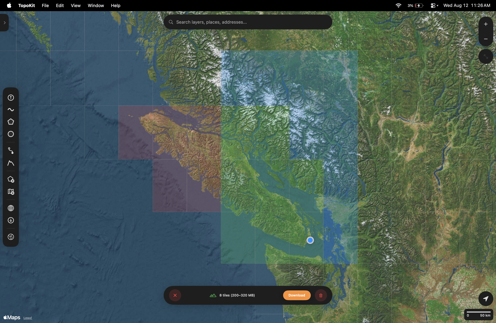

TopoKit reads point elevations and route climb from a global digital elevation model, and works offline once its tiles are downloaded.

## Elevation data source

Elevation comes from the [Copernicus GLO-30 Digital Elevation Model](https://dataspace.copernicus.eu/explore-data/data-collections/copernicus-contributing-missions/collections-description/COP-DEM), distributed as 1°×1° tiles. Each value covers about 30 metres of ground, measured from sea level rather than from the ellipsoid. That has three consequences:

- Terrain narrower than about 30 metres — a gully, a levee bank — is not in the model at all.
- Values are orthometric: comparable to what a topographic map calls elevation above sea level, not to the ellipsoidal height a GNSS receiver reports. The two differ by roughly −100 m to +85 m depending on where you are.
- The model is a surface: in forested or built-up areas the value can be canopy or roof rather than bare earth.

No other elevation source is supported. A GeoTIFF you load as a [raster](/manual/raster-overlays/) is drawn as imagery, not read as elevation.

## Downloading tiles

A tile reaches your device one of two ways: a query fetches it, or you select it in the DEM Tile Manager. Both store tiles in the app's own data area rather than a temporary cache, so they survive reboots until you remove them. A tile runs 25–40 MB, depending on latitude and terrain.

### On demand

When a query needs a tile you don't have, TopoKit offers to fetch it:

- **The elevation measurement tool** shows **Download N elevation tiles (X MB)** on the [tool card](/manual/interface/), and downloads nothing until you tap it.
- **The point editor** shows :ui[Get Elevation] with the download size beside it.
- **The elevation profile on a saved line** downloads without asking: the button's subtitle names the tile count and size before you open it, and opening it fetches what is missing.

### The DEM Tile Manager

Open the Tile Manager from :ui[Download Data]{icon=download-data}, then the **Elevation Data** card. :mac[On Mac, **Download Data** is in the tool sidebar.] :ios[On iPhone, **Download Data** is in the [Layers tab](/manual/layer-tree/)'s :ui[plus]{icon=plus} menu.] A grid appears over the map, and each cell shows its state:

- **Green**: already on disk.
- **Blue**: selected for download.
- **Red**: selected and already on disk, so it is flagged for deletion instead.
- **Grey**: a cell whose download previously failed.
- **No cell at all**: the dataset does not publish that area, so there is nothing to select.

Select the cells you want and choose **Download**. The bar counts the new tiles and estimates their size, and a tile the network drops is retried on its own.

Selecting a cell that is already on disk flags it for deletion rather than download, and a red trash button appears in the bar to remove exactly those tiles.

### Reviewing and deleting tiles

Open [Settings → Storage & Cache](/manual/ui-settings-styling/#storage-and-cache) and find the **Elevation Data** section:

- **Manage Tiles** opens **Downloaded Elevation Tiles**, one row per tile with its size and a delete button. It stays unavailable until you have downloaded at least one tile.
- **Clear All** deletes every downloaded tile, asking first and naming the count and total size.

To clear a whole corner of the map instead of picking tiles off a list, select those cells in the Tile Manager.

## Coverage gaps

The dataset does not cover every cell: open ocean, most of Antarctica, and cells above 83°N are not published. In the Tile Manager those cells carry no grid overlay, so you cannot select them, and a point elevation query there returns no value.

Armenia and Azerbaijan are absent from the release TopoKit reads, so they behave the same way: no cell to select, and no elevation to return.

**A profile that crosses water draws straight through the gap.** The chart connects the shore points on either side, so a flat span over water is interpolation rather than data. A note below the chart reads "Some elevation data unavailable (N tiles missing)".

That note counts whole tiles that are not on disk. Where a downloaded tile simply holds no value under your line — a NoData pixel at a coastline or an ice sheet — those samples are dropped with no note at all.

## Disk-space planning

For rough planning, assume 30 MB per tile and work out how many 1°×1° cells your area covers:

- A single county or watershed: 1–4 tiles, roughly 30–120 MB.
- A moderate-sized US state or small European country: 20–40 tiles, 600 MB to 1.2 GB.
- A whole continent: thousands of tiles, hundreds of GB.

## Elevation queries: point and profile

TopoKit answers two kinds of elevation question.

**Point elevation.** TopoKit finds the covering tile and interpolates between the four surrounding DEM values. If any of the four is NoData, the result is empty rather than zero.

**Profile along a line.** TopoKit samples the line about every 30 metres, matching the DEM's own resolution, and builds a series of distance and elevation pairs. A segment shorter than 30 metres still contributes a sample at its far vertex, so a saved GPS track with fixes a few metres apart is sampled at every fix.

<video src="/media/elevation-profile-hover.mp4" autoplay loop muted playsinline aria-label="The elevation profile panel open on a saved line: moving along the chart marks the matching position on the map, with the min, max, average, gain, loss and distance stats below"></video>

Moving along the chart marks the matching spot on the map, so you can see where a climb or a drop actually is. :mac[On Mac, the marker follows the cursor.] :ios[On iPhone, drag along the chart.]

The stats below the chart:

- **Min**, **Max** and **Avg**: taken from the samples, so a summit falling between two samples is not in the maximum.
- **Gain** and **Loss**: the sums of the positive and negative steps between samples.
- **Distance**: the real length of the line, summed segment by segment, not the sample count multiplied by 30 metres.

### The Elevation Profile tool

The tool sidebar's :ui[Elevation Profile]{icon=elevation-profile} button is separate from the [profile you open on a saved line](/manual/points-lines-polygons/#line-elevation-profile): it builds a temporary path and charts it without saving a layer. It offers two modes:

- **Points mode**: tap the map to drop waypoints, and TopoKit connects them with straight segments.
- **Route mode**: tap a start and an end, and TopoKit follows a road route from [Apple Maps directions](/manual/directions-and-routing/) — walking by default, switchable to driving — sampling elevation along the real road geometry.

Both modes share the same chart and stats. You can switch modes mid-measurement; the placed points and the panel reset.

The :ui[Save] button on the tool card opens the same line editor a drawn line opens, so you can name the feature before it is saved.

## FAQ

**Why is elevation missing in some areas?**

Either the cell is not published at all, or the tile is downloaded and the pixels under your query hold no value — most often near coastlines and ice sheets. See [Coverage gaps](#coverage-gaps).

**Why is the elevation different from my handheld GPS reading?**

Your receiver reports height above the ellipsoid while the DEM stores height above sea level, and the two differ by tens of metres almost everywhere. GLO-30 is also a surface model at 30-metre resolution, so it does not resolve the exact spot you are standing on. See [Elevation data source](#elevation-data-source).

**Can the app work with elevation when offline?**

Yes, as long as the tiles are already on disk: lookups read them straight from storage, so they behave the same with or without a connection. If a tile is missing and you have no connection, the download waits for the network rather than failing — close the panel and fetch the tiles when you are back online.
