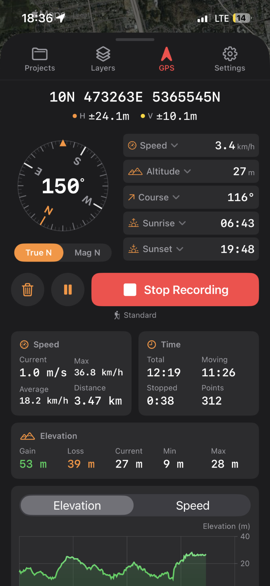
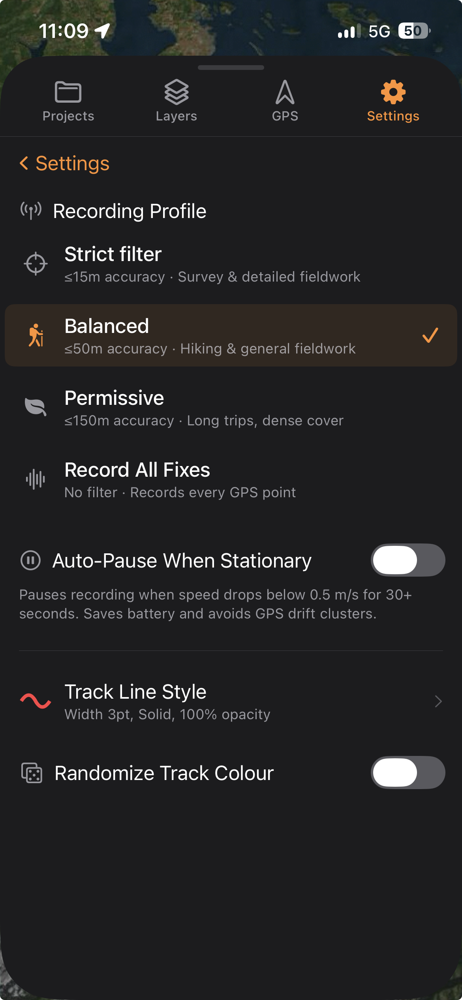

The GPS tab shows your live position, a compass, and five readings you choose, and records your route as a track you can save into the project. TopoKit filters fixes as they arrive, dropping the ones that are too inaccurate, too old, or implausibly far from the last.

**The GPS tab is iPhone only.** The Mac records no tracks, and the GPS & Recording settings page does not appear there.

## Location permissions

:::ios
On iPhone, TopoKit asks for **When In Use** location access during first-launch onboarding — tapping the **Location** row on the permissions page brings up the system prompt. If you skipped that step, the prompt appears the first time you use anything that needs your position, such as opening the GPS tab or [centring the map on your location](/manual/map-tools/#centring-on-your-location).

iOS also exposes a second toggle, **Precise Location**, that you can turn off independently of the permission grant. With it off, iOS returns approximate fixes with horizontal accuracy in the several-hundred-metre to 1-km range.

**With Precise Location off, the accuracy filter rejects nearly every fix.** An orange banner appears while you record in that state.

If you deny permission or revoke it later, the GPS tab shows a full-screen prompt with a button that opens the relevant Settings pane. Revoking permission during a recording does not lose the recording: the tab stays on screen with a red banner above the controls, and Pause, **Stop Recording** and the trash button all keep working.
:::

:::mac
TopoKit still uses location on the Mac for the map's show-my-location marker and initial centring: it asks for permission the first time that is needed. macOS has no Precise Location toggle — permission is all or nothing. Macs have no magnetometer, so heading (compass) data is never available on macOS.

You work with recorded tracks on the Mac after they [sync into the project](/manual/projects-and-files/#icloud-sync).
:::

:::ios
## The GPS tab

At the top of the tab:

- **Latitude and longitude** in the app's [preferred coordinate format](/manual/ui-settings-styling/#units-and-coordinates). With the format set to UTM, the two lines are replaced by a single **Coordinates** line.
- **Horizontal accuracy (H)** and **vertical accuracy (V)** pills, colour-coded: green ≤ 5 m, yellow ≤ 15 m, orange ≤ 50 m, red worse than 50 m. A grey dot and `--` mean the system is not reporting that figure yet, which happens most often to vertical accuracy.

### The compass and declination

Below that is a compass dial driven by the iPhone's magnetometer. It shows where the phone is pointing, not your direction of travel, so it does not swing around to match your course once you are moving.

A two-button toggle underneath, labelled **True N** and **Mag N**, switches the display between true north and magnetic north. The toggle is not local to the GPS tab: it writes the app-wide **Bearing** default, the same setting as [Settings → Measurement Defaults → Bearing](/manual/ui-settings-styling/#units-and-coordinates), so tapping **Mag N** here also changes which north the measurement tools start in.

The difference between the two is the [magnetic declination](/manual/measurement/#bearing), available as one of the stat slots below. It reads as a magnitude with a direction: **E** when true bearings run larger than magnetic, **W** when they run smaller.

### The stat slots

Next to the compass are five configurable stat slots. Tap a slot's label to open the picker and choose what it reads. Nine readings are available:

- **Speed**: your current speed, in km/h or mph.
- **Course**: your direction of travel in degrees, which is what you are doing rather than where the phone points.
- **Altitude**: the GPS altitude, in metres or feet.
- **Mag Declination**: the difference between true and magnetic north at your position, as a magnitude with an **E** or **W**.
- **Last Fix**: the time of the most recent fix, so you can tell a frozen readout from a live one.
- **Heading Accuracy**: how far the compass reading could be off, in degrees.
- **Dist. Traveled**: an odometer for the tab rather than for a recording. It counts from the moment you opened the GPS tab, runs whether or not you are recording, ignores fixes worse than 50 m whatever profile is set, and will not match the Distance figure in the Speed card. Leaving the tab and coming back starts it at zero.
- **Sunrise** and **Sunset**: computed on-device from your latitude, longitude, and date. At high latitudes they read "N/A" for polar day or polar night.

TopoKit remembers each assignment across launches. Tapping any stat copies its value, flashing "Copied" as confirmation.

## Recording a track

1. Open the GPS tab.
2. Tap **Record Track**.
3. Tap **Pause** for a rest break.
4. Tap **Stop Recording** when the track is finished.

A track records into an open project. With none open, **Record Track** shows a brief "Open or create a project to get started" notice — open or create one from the [Projects tab](/manual/projects-and-files/) first.

While a recording runs, the button turns red, pulses, and reads **Stop Recording**. TopoKit draws a live red line on the map as fixes arrive. If 60 seconds pass without a single fix being accepted, a banner appears at the top of the tab, with a dismiss button that resets on a new recording.

**Pause** holds the recording open and adds no fixes until you resume. Every resume starts a new segment in the saved track, as does any gap longer than 60 seconds. Segments are what keep the map from drawing a line across the part you did not record — the live red line is not split, so the break appears once you save.

**Stop Recording** pauses first, then raises a **Recording Paused** alert with three choices: **Save Recording** opens a name prompt, **Delete Recording** opens a confirmation, and **Cancel** resumes recording. The **trash** button next to Pause goes straight to that confirmation, which warns that the recorded points cannot be recovered.

After saving, the track is added to your [layer tree](/manual/layer-tree/) as a line feature with the trip statistics attached as properties.

### Auto-pause

Auto-pause is off by default. Turn on **Auto-Pause When Stationary** in [Settings → GPS & Recording](/manual/ui-settings-styling/#gps-and-recording), and a recording pauses itself once the reported speed stays below 0.5 m/s for 30 seconds, then resumes when you move at 1.0 m/s or more. The gap between the two thresholds keeps a slow stretch from pausing and resuming repeatedly.

Without auto-pause, receiver drift larger than the distance filter still gets through, so a water break adds a cluster of points at one spot for as long as you stand there.

### Recording profiles

Choose one with **Recording Profile** in [Settings → GPS & Recording](/manual/ui-settings-styling/#gps-and-recording). The profile is read when you tap **Record Track**, so a change takes effect on your next recording. Each profile bundles accuracy settings, filter thresholds, and battery behaviour:

| Profile             | Distance filter | Accuracy threshold | Jump threshold | Max velocity    | Desired accuracy       |
| ------------------- | --------------- | ------------------ | -------------- | --------------- | ---------------------- |
| Strict filter       | 3 m             | ≤15 m              | 200 m          | 15 m/s (33 mph) | Best available         |
| Balanced (default)  | 8 m             | ≤50 m              | 500 m          | 40 m/s (90 mph) | Best available         |
| Permissive          | 20 m            | ≤150 m             | 1000 m         | 150 m/s         | Nearest 10 m           |
| Record All Fixes    | 0 m             | no filter          | no filter      | no filter       | Best available         |

- **Distance filter**: how far you must move before the system delivers another fix.
- **Accuracy threshold**: the worst reported accuracy a fix can have and still be kept.
- **Jump threshold and max velocity**: a fix has to exceed both before it counts as an impossible jump.
- **Desired accuracy**: the battery tradeoff. Best requests the highest accuracy available; Nearest 10 m lets iOS use lower-power positioning sources.

**Balanced** accepts fixes up to 50 m, which covers how far accuracy degrades under tree canopy or among buildings. **Strict filter** suits survey and detailed cross-country work. **Permissive** suits long trips and dense cover, where coverage matters more than precision. **Record All Fixes** saves everything the system delivers, for raw data you intend to post-process yourself.

### How fixes are filtered

Every fix from the system location service passes four checks before it is added to the track:

1. **Accuracy.** Horizontal accuracy must be at least 0 and no worse than the profile's threshold. Record All Fixes skips the threshold but still rejects fixes the system flags as invalid.
2. **Age.** Fixes older than 10 seconds are rejected on every profile, so a recording is never back-filled with cached positions after a signal gap.
3. **Distance from the last point.** A fix closer than half the profile's distance filter is dropped without counting as a rejection. With Record All Fixes this never fires.
4. **Impossible jumps.** A fix is rejected only when its distance from the last point exceeds the jump threshold *and* its implied speed exceeds max velocity. A car at 80 mph is kept; a large shift while you stand still is not.

## Trip statistics

During recording the dashboard shows three cards:

- **Speed**: current, max, average, and distance travelled. The average is distance divided by moving time, so a rest break does not drag it down.
- **Time**: total, moving time (time above 0.3 m/s, a lower bar than auto-pause's 0.5 m/s), stopped time, point count, and a **Rejected** row, which appears only once a fix has been rejected. The total excludes every second spent paused, so a recording paused for an hour reports the same total as one that was never paused.
- **Elevation**: gain, loss, current altitude, min, and max. Gain and loss use a 2-metre noise threshold, so receiver jitter does not add tens of metres of climb to a flat walk.

Below the cards is a switchable chart showing either the elevation profile or the speed profile over distance. It samples at most once per 10 metres, and the interval grows with the track: about 500 samples at 5 km, and roughly 1,200 by 20 km.

## Saving a track and its properties

When you save a track, the [line feature](/manual/points-lines-polygons/#lines) carries these properties. Values are stored in raw SI units, so the file imports into other GIS tools without unit conversion:

- `track_distance`, `track_duration`, `track_moving_time`, `track_stopped_time`: metres and seconds. `track_duration` is the paused-time-excluded total the Time card shows, not the wall-clock span.
- `track_elevation_gain`, `track_elevation_loss`, `track_min_altitude`, `track_max_altitude`.
- `track_max_speed`, `track_avg_speed`: in m/s. `track_avg_speed` is the same moving-time average the Speed card shows.
- `track_point_count`, `track_segment_count`, `track_avg_accuracy`.
- `track_recorded`, the moment you tapped **Record Track**, and `track_end_time`, the timestamp of the last fix, both ISO-8601.
- `track_profile`, which stores the profile's internal identifier rather than its menu name: `highPrecision` (Strict filter), `standard` (Balanced), `batterySaver` (Permissive), or `recordAll`.

A single-segment track is saved as LineString geometry; a multi-segment track is saved as [MultiLineString](/manual/vector-import-export/#gpx).

## Background recording and crash recovery

Once a recording starts it keeps running in the background: you can lock the phone, switch to other apps, and the track continues. The system's location indicator stays lit the whole time.

TopoKit saves a snapshot of the track to disk every 30 seconds or every 100 metres, whichever comes first, and again whenever you pause or leave the app. If iOS terminates TopoKit, you force-quit it, or it crashes, the next launch offers to recover the unsaved recording as a new track.

A recovered track arrives named "(Recovered)" and keeps its points, distance, duration, altitude range and average accuracy. Elevation gain and loss, max and average speed, and moving and stopped time are not recovered, and its `track_duration` is the wall-clock span rather than the paused-time-excluded total.

## FAQ

**Why does my track have zigzags on a straight road?**

A consumer GNSS receiver's typical position error is 3–8 m in open sky, and worse near buildings, trees, or in narrow valleys. The filter accepts any fix within the profile's accuracy threshold, so small zigzags inside that margin are not glitches and are not removed. Switch to **Strict filter**, which rejects anything worse than 15 m, or move somewhere with a clearer view of the sky.

**Why did my recording auto-pause when I was still moving?**

Auto-pause reads the speed the system reports, not positional change. Starting from stationary, or shifting a few centimetres at a viewpoint, the reported speed can read as zero even while fixes arrive. Turn auto-pause off in Settings if it gets in the way.

**What's the battery impact?**

Continuous recording at full GPS accuracy costs 10–15% battery per hour on an iPhone. That range is an estimate rather than a measured figure, and it moves with satellite visibility and whether the screen is on. Permissive draws less because it requests reduced accuracy. Strict filter and Balanced request the same best-available accuracy and draw about the same power: Strict just discards more of what it captures.

**What happens if my battery dies mid-recording?**

A dead battery is treated as a crash, and the next launch offers to recover the recording. See [Background recording and crash recovery](#background-recording-and-crash-recovery).
:::
