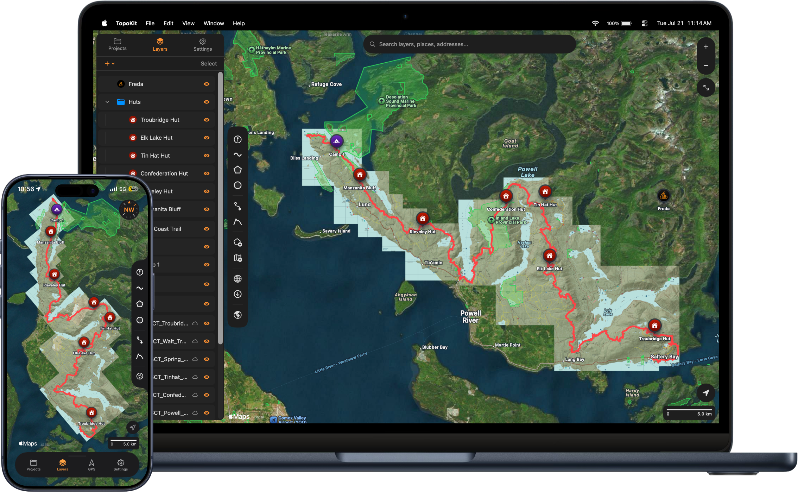
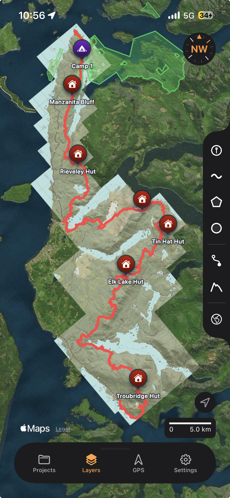
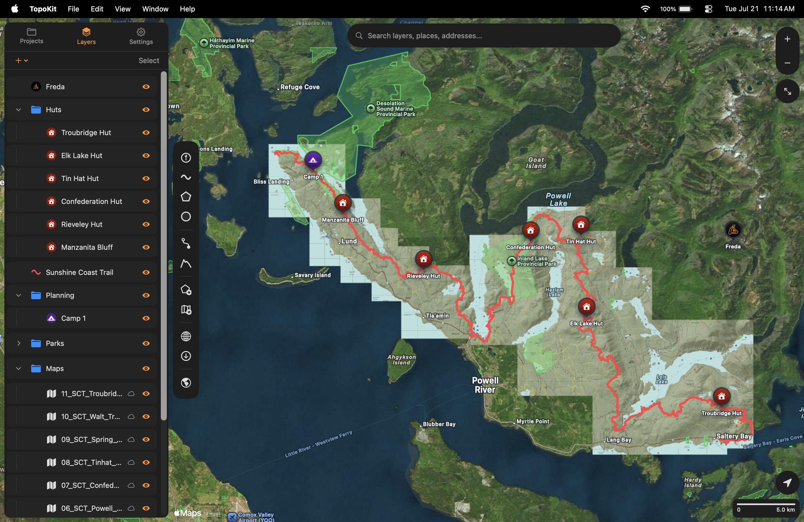

Everything in TopoKit happens in one of three places: on the map, in the panel that holds your data, or in the sidebar that holds your tools.

## The map

The map takes centre stage on both platforms, and everything you add or create draws on top of an Apple base map. The bottom icon on the tool sidebar switches between :ui[Standard]{icon=map-standard}, :ui[Hybrid]{icon=map-hybrid}, :v11[and ]:ui[Satellite]{icon=map-satellite}:v111[, and :ui[No Map]{icon=map-no-map}]. Floating above the map you will find:

- **Compass** — appears when the map is rotated, and returns the map to north-up when tapped.
- **Zoom** — :ios[On iPhone, zoom has no on-screen controls and works through pinch-to-zoom.] :mac[On Mac, a + / − pair, with a zoom-to-extent button below it that frames every visible feature and raster in the project, not just what is already on screen.] To zoom to a single feature, use its row menu in the [layer tree](/manual/layer-tree/).
- **Location button** — centres the map on your position. :ios[On iPhone, further taps make the map follow you as you move.] See [Centring on your location](/manual/map-tools/#centring-on-your-location).
- **Scale bar** — follows your metric or imperial preference. Change it in Settings → Units & Coordinates.
- **Tool sidebar** — holds the tool buttons and, at the bottom, the base map switch. Nothing else lives on it: zoom, the compass and the location button are separate controls on the map. Every button is covered in [Map tools](/manual/map-tools/).
- **Search bar** — finds your own features, addresses and places, and typed coordinates. :mac[On Mac it is in the top bar above the map.] :ios[On iPhone it is at the top of the **Layers** tab.] See [Map UI, settings and styling](/manual/ui-settings-styling/#search-bar).
- **Tool card** — appears at the bottom of the screen whenever a tool is running, showing that tool's live measurements and its :ui[Cancel]{icon=x} / :ui[Undo] / :ui[Save] actions. Tapping a unit changes it; tapping a value copies it. Every drawing, measuring, elevation and download task runs through a tool card.

:::ios
## iPhone layout

The iPhone app is a full-screen map with a **bottom sheet** that you drag between three heights, from a slim tab-bar strip up to full screen.

The sheet holds four tabs:

- :ui[Projects]{icon=folder}: where all your projects live. Create a new project, open an existing one, move them between local and iCloud storage, and see each one's sync state.
- :ui[Layers]{icon=layers}: the layer tree for the open project, with the :ui[plus]{icon=plus} menu for creating folders, importing files, and adding tile layers.
- :ui[GPS]{icon=gps}: your live position and accuracy, a compass, customizable readouts — speed, course, altitude, sunrise and sunset among them — and track recording.
- :ui[Settings]{icon=settings}: every preference.

The **tool sidebar** is on the left or right edge, whichever you choose in Settings → Toolbar, which also sets the icon size. A long press on a button shows its name. While a tool is active the sidebar is hidden, and it reappears when you finish.

### Gestures

Three gestures are less obvious than pan, pinch and two-finger twist:

- **Tap a point** to open its info card at the bottom of the screen. Points are the only tappable feature; open lines and polygons from the layer tree.
- **Drag a vertex** to move it while you are drawing a line or polygon.
- **Swipe the sidebar** toward its edge to hide it.
:::

:::mac
## Mac layout

The Mac app is a full-window map with a single **floating panel** beside the tool sidebar. The panel has three tabs:

- :ui[Projects]{icon=folder}: where all your projects live. Create a new project, open an existing one, move them between local and iCloud storage, and see each one's sync state.
- :ui[Layers]{icon=layers}: the layer tree for the open project, with the :ui[plus]{icon=plus} menu for creating folders, importing files, and adding tile layers.
- :ui[Settings]{icon=settings}: every preference.

The panel resizes when you drag its edge, and collapses to a slim **pull tab** when you want the whole map. **Panel Position** in Settings puts it on the left or right of the screen.

The compass appears in the **top bar** when the map is rotated.

### Mouse and keyboard

- **Click a point** to open its info in a popover anchored to the pin itself, rather than a card at the bottom of the window. Points are the only clickable feature; open lines and polygons from the layer tree.
- Right-click the map to copy the coordinates in several formats, and — with a project open — drop a pin, get directions, or measure from that spot.
- Right-click a layer row for its full action menu.
- `Cmd-N` opens a new project, `Cmd-O` an existing one, `Cmd-S` saves now, `Cmd-Z` and `Cmd-Shift-Z` undo and redo, and `Cmd-,` opens settings. `Cmd-W` closes the project and leaves the window open.
:::

## Interface settings

**Theme** and **UI Style** are in **Settings → Appearance & Controls**:

- **Theme**: overrides the system light/dark setting for TopoKit. It applies to the whole window, base map included, though satellite and hybrid imagery looks the same either way.
- **UI Style**: how the floating controls render — **Solid** (opaque, the default — the map never shows through, so the controls keep the same contrast whatever is under them), **Blur** (frosted, blurring the map behind), or **Glass** (Apple's translucent Liquid Glass material).
- **Settings → Toolbar** (iPhone) and **Panel Position** (Mac) reposition the tool sidebar or panel.

The full settings reference is in [Map UI, settings and styling](/manual/ui-settings-styling/).

## FAQ

**My tool sidebar disappeared. Where did it go?**
On iPhone, one of three things has happened: a tool is active and the sidebar is hidden until you finish, you dragged the bottom sheet up past about a fifth of the screen (it fades out and is gone by 40%, so drag the sheet back down), or you swiped the sidebar off — tap the chevron tab at the edge, or check Settings → Toolbar → Show Toolbar. On Mac nothing hides.

**Can I move the panel or sidebar to the other side?**
Partly. On Mac, Settings → Appearance & Controls → Panel Position moves the floating panel to the left or right edge; the tool sidebar always stays on the left and cannot be moved. On iPhone, Settings → Toolbar → Position moves the tool sidebar to either edge.

**Why are my floating controls see-through (or not)?**
That is the UI Style setting: Glass and Blur are translucent, Solid is opaque. Solid is the default: being opaque, it keeps the same contrast whatever the map is showing behind it.
