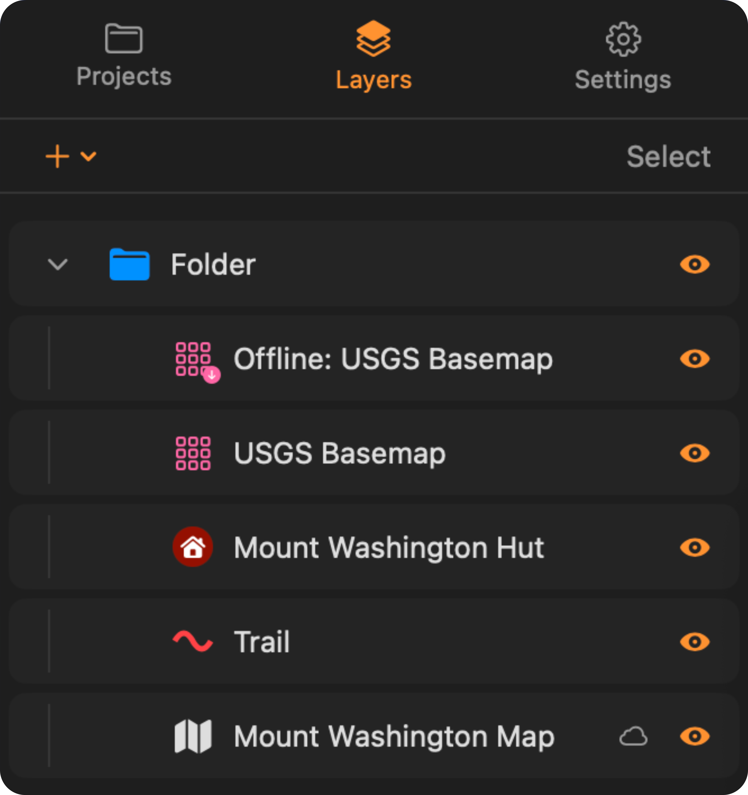
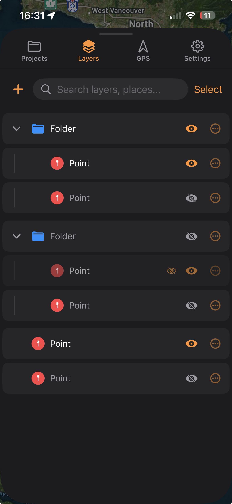

The layer tree is the **Layers** tab: a list of everything in your project, in the order it draws on the map. To find one row by name instead of working down the list, use the [search bar](/manual/ui-settings-styling/#search-bar).

## What is in the tree

Everything you draw or import appears here as a row, and every row is one of four types:

- **Features**: points, lines, and polygons you have drawn or imported.
- **Raster overlays**: imported GeoTIFF or georeferenced PDF maps.
- **Tile layers**: web base maps you have added.
- **Folders**: any of the above, nested to any depth.

A feature's row previews its own style, so a point shows its coloured pin and a line or polygon shows its stroke and fill.

Downloading a tile layer for offline use does not change its row. The download adds a separate **Offline: {name}** row at the top of the same folder, with a badge showing whether the tiles are on this device: a small download arrow when they are, and a dimmed icon with an orange iCloud symbol when the layer arrived by project sync but its tiles did not. A download still running is not a row state: :ios[On iPhone it shows as a banner at the top of the Layers tab.] :mac[On Mac it shows as a progress bar on the map.]

## Draw order

Rows higher in the tree draw on top of rows below them.

A layer that is switched on can still be missing from the map, because something above it in the tree is covering it. A tile layer covers the whole map, so anything below it in the tree is hidden everywhere; a raster only hides the area inside its own footprint, so the same layer can be hidden in one part of the map and visible in another. Drag the covering layer below your data to see it again.

## Folders

Importing vector data always creates a folder named after the file, with every feature from the file as a row inside it.

To create a folder:

:::ios
On iPhone, tap :ui[plus]{icon=plus} in the Layers toolbar and choose **New Folder**. To nest one inside another, tap :ui[More]{icon=ellipsis} on a folder's row and choose **New Subfolder**, or drag an existing folder into it.
:::

:::mac
On Mac, use the :ui[plus]{icon=plus} menu in the Layers toolbar and choose **New Folder**. To nest one inside another, right-click a folder and choose **New Subfolder**, or drag an existing folder into it.
:::

New folders and imported data appear at the top of the tree. **New Folder** asks for a name before it creates anything; **New Subfolder** creates a folder called "New Subfolder" immediately, which you then rename.

TopoKit remembers which folders you left open. Closing a folder only shortens the list; its contents still draw on the map.

A folder's style editor changes the features directly inside it. It skips anything nested in a subfolder, and it does not change features you add to the folder later. Restyle that subfolder separately. See [Points, lines, polygons and circles](/manual/points-lines-polygons/).

## Moving rows around

Drag a row to move it, whether it is a feature, a raster, a tile layer, or a folder with everything inside it. Drop it on a folder to put it in that folder, or between two rows to set its position in the draw order.

:::mac
On Mac, command-click to add rows to a selection, then drag them together.
:::

:::ios
On iPhone, dragging moves one row at a time. To move several, tap **Select**, choose the rows, and tap **Move**.

For a single row, **Move to...** in the :ui[More]{icon=ellipsis} menu moves it without dragging: pick the destination folder, or **Root Level** to move it out of all folders, then tap **Move**. The list is every folder in the project, alphabetically and without nesting, minus the folder you are moving and anything inside it.
:::

**Group** collects the checked rows into one new folder called **New Group**, placed where the topmost checked row was, and opens it so you can rename it immediately. **Move** sends them all to a folder you pick, or to **Root Level**. Hide, delete, share and export do to every checked row what the row menu does to one.

## Showing and hiding

Every row has its own :ui[eye]{icon=eye} on the right, folders included. While **Select** is on, the eye is hidden; use **Hide** in the selection toolbar instead.

A hidden folder hides every row inside it, whatever each row's own eye is set to. A layer that is switched on but does not appear on the map is most often inside a hidden folder. The row dims and shows an orange :ui[crossed-out eye]{icon=eye-hidden} when a folder above it is hiding it. Check each folder above the row and switch the hidden one back on.

## Renaming

:::ios
On iPhone, tap a row to open its editor, change the **Name**, and tap **Done** (**Save** for folders and tile layers).
:::

:::mac
On Mac, click a row to open its editor, type the new name, and click outside to apply it.
:::

## Deleting

Deleting a folder deletes everything inside it, including any folders nested within. TopoKit always asks first.

:::mac
On Mac, a right-click delete never names what it is deleting. On one row the prompt is a bare **Delete Layer?**; on a selection it reads **Delete N Items?**, with a count but no names. Check what is highlighted before confirming.

**Right-clicking a row that is part of a selection deletes the whole selection**, not the row under the cursor. The menu item says **Delete N Items** when that is what will happen. Right-clicking a row outside the selection deletes only that row and leaves the selection alone.

Press `Cmd-Z` to undo: the whole folder comes back, contents included, in its original position. **The confirmation is wrong when it says this cannot be undone** — on Mac it can. There is no redo afterwards, though, and a multi-row delete is registered as one undo step per row, so check the tree rather than assuming a single `Cmd-Z` took all of it back.
:::

:::ios
On iPhone, the confirmation names the row and warns that its contents go with it. There is no undo, so read the confirmation before you tap Delete. If you are unsure about a folder, hide it instead, or move the parts you want to keep out of it first.
:::

## Platform differences

The tree holds the same rows on both platforms.

:::mac
On Mac, click a row to edit it, or right-click for the full menu: hide, zoom to, share, export, delete, and actions specific to that row, such as directions for a point, an elevation profile for a line, or an offline download for a tile layer.

**Select**, at the right of the Layers toolbar, turns the tree into a checklist. To select a range, turn on **Select**, click the first row, then Shift-click the last.
:::

:::ios
On iPhone, tap a row to edit it, or tap :ui[More]{icon=ellipsis} for the full menu: hide, zoom to, share, export, delete, **Move to...**, and actions specific to that row, such as directions for a point, an elevation profile for a line, or an offline download for a tile layer.

**Select**, in the Layers toolbar beside the search bar, turns the tree into a checklist.
:::

## FAQ

**A layer is switched on but I cannot see it on the map. Why?**
Most often a folder above it is hidden, which hides its contents regardless of each row's own eye setting. Otherwise something opaque is above it in the tree, such as a tile layer or a raster, or the layer does not cover the part of the map you are looking at.

**I moved a feature into a folder. Did its appearance change?**
No. Moving a feature never restyles it. Only a folder's style editor changes the styles of the features inside a folder.

**I deleted a folder by accident. Can I get it back?**
On Mac, yes: `Cmd-Z` restores it with everything that was inside. On iPhone there is no undo, so a delete is final once you confirm it. If the project is in iCloud and synced before the delete, another device may still have the older copy; see [Projects and files](/manual/projects-and-files/).
