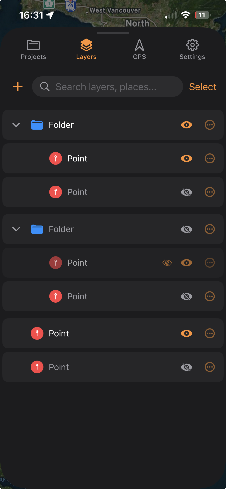

The Layers tab lists everything in the open project, in the order it draws on the map. :ios[On iPhone, the search field at the top of the tab finds rows by name as well as places.] [Search](/manual/search-and-identify/#search) covers what it finds.

## What is in the tree

A row is a feature (a point, line or polygon, drawn or imported), a raster overlay (an imported GeoTIFF or GeoPDF map), a tile layer (streamed from a server, or a basemap you built) or a folder, which holds any of these nested to any depth.

An **Offline: {name}** row's icon carries a small download arrow when the tiles are on this device, and is dimmed with an orange iCloud arrow when the project arrived by sync and the tiles did not ([Using offline tiles](/manual/tile-layers/#using-offline-tiles)).

## Draw order

Rows higher in the tree draw on top of rows below them.

A layer that is switched on can still be missing from the map, because something above it in the tree is covering it. A tile layer covers the whole map, so anything below it in the tree is hidden everywhere; a raster only hides the area inside its own footprint, so the same layer can be hidden in one part of the map and visible in another. An offline tile layer covers only the regions you downloaded, a basemap you built covers only the area it was built for, and a layer faded below 5% opacity covers nothing at all.

Points are not stacked with lines and polygons: a point always draws above every line and polygon, whatever the tree says. A point below a raster or tile layer is removed wherever that layer covers it, even a partly transparent one, and for a raster that means anywhere inside its bounding box. A line or polygon below one stays drawn and shows through as far as the layer's opacity allows.

The place and road names on Apple Maps draw over your lines and polygons until a raster or tile layer in the project is showing. From the lowest such layer up, every row in the tree draws over those names; rows below it stay under them. A basemap you built counts as such a layer only with [**Solid Background**](/manual/basemaps/#the-setup-page) on.

A new folder, drawn feature, import, raster or tile layer goes to the top of the tree or of its folder, so a new tile layer covers everything already there. A new basemap is the exception: it goes to the bottom, or directly above a top-level basemap it overlaps.

## Folders

Choose **New Folder** from the :ui[Add Data]{icon=plus} menu in the Layers toolbar, :mac[on Mac also **Layer → New Folder** (`Cmd-Shift-N`),] or **New Subfolder** from a folder's :ui[Layer options]{icon=ellipsis} menu (its right-click menu on Mac) to make one inside it.

To put rows you already have into a new folder, use **Group** in the **Select** bar, or **New Folder with “{name}”** in a row's menu. Each makes a folder called **New Group** in the place of the topmost chosen row, puts the rows inside it in their order, and opens its editor.

Closing a folder only shortens the list; its contents still draw on the map.

## Styling a folder

Tap a folder's row on iPhone, or click it on Mac, to open **Edit Folder**. It has a style row for each kind of feature directly inside the folder, and only for those kinds, so an empty folder cannot be styled in advance. A folder has no style of its own, so the sheet starts from the style of the first feature of that kind inside it.

When you choose **Done**, the style is written onto the features of that kind directly inside the folder, replacing styles set on them one by one, and a single Undo reverses it. Features in its subfolders keep their own styles.

It is not a live default: a feature you draw afterwards starts from the **Default Style** in [**Settings → Features**](/manual/settings/#features). [Styling a feature](/manual/points-lines-polygons/#styling-a-feature) covers the sheets' controls.

## Selecting several rows

:::ios
On iPhone, **Select** turns the tree into a checklist for the bar's **Hide**, **Delete**, **Share** and **Export**. **Delete** and **Group** end Select; **Hide** leaves the rows checked for another action.
:::

:::mac
On Mac, **Select** in the Layers toolbar does the same. Command-click and Shift-click turn it on as well; a Shift-click range skips rows inside closed folders.

Right-clicking a row that is part of the selection acts on every selected row. A row inside a selected folder goes with its folder when the selection is moved, copied, shared or exported.
:::

## Moving rows

Drag a row to move it; a folder moves with everything inside it. Drop it on a folder to put it in that folder, or between two rows to set its position in the draw order.

A row dropped on a folder, or moved into one, goes to the bottom of that folder. A row moved to **Root Level** goes to the bottom of the tree.

:::ios
On iPhone, dragging moves one row at a time. For a single row, **Move to...** in the :ui[Layer options]{icon=ellipsis} menu lists the folders alphabetically and without nesting, plus **Root Level** to move it out of all folders. To move several rows, check them under **Select** and tap **Move** in the bar.
:::

:::mac
On Mac, drag any selected row to move the whole selection; the rows keep their order. Holding a dragged row at the top or bottom edge scrolls the list, and a row dropped there goes back where it was.

To move rows without dragging, right-click one and choose **Move to**, or choose **Layer → Move To** for the selected rows. Folders the rows cannot go into are greyed out.
:::

## Showing and hiding

A hidden folder hides every row inside it, whatever each row's own eye is set to. A layer that is switched on but does not appear on the map is most often inside a hidden folder. The row dims and shows an orange :ui[crossed-out eye]{icon=eye-hidden} when a folder above it is hiding it.

On a selection, **Hide** reads **Show** only when every selected row is already hidden.

**Zoom to**, in a row's menu, on a folder frames the features and rasters inside it at every depth, ignoring tile layers, and leaves the map where it is when it holds neither. A tile layer frames the area downloaded for it, or zooms out to a world view when nothing was downloaded. :mac[On Mac, with several rows selected, **Zoom to** or **Layer → Zoom to N Layers** frames them the way it frames a folder that holds them.]

## Renaming

:::ios
On iPhone, tap a row to open its editor and change the **Name**. A folder or tile layer editor needs **Save**, and going back without it keeps the old name; a point, line, polygon or raster editor, and **Edit Offline Basemap** for a basemap you built, keep the new name when you leave them.
:::

:::mac
On Mac, click a row to open its editor, type the new name, and click outside to apply it.
:::

A folder name cleared to nothing or to spaces is not applied. Renaming a folder is a step on the undo history; a new name given to a point, line, polygon, raster or tile layer in its editor is not. See [Undo and redo](/manual/interface/#undo-and-redo).

Opening the editor of a point, line, polygon, raster or tile layer, and a folder's style, are part of the full app ([What asks you to unlock](/manual/your-topokit/#what-asks-you-to-unlock)).

## Copying, pasting and duplicating

**Copy** puts rows on the clipboard with their style, description and attributes, and a folder copies with everything inside it. **Paste** adds the copies as new rows, in any project, so features can be copied from one project into another.

On a folder, **Paste** reads **Paste into “{name}”** and adds the copies at the bottom of that folder; on any other row it adds them directly below that row. **Duplicate** puts a copy directly below the original, with "copy" added to the end of its name.

Photos and a tile layer's downloaded tiles are not copied. Raster overlays and basemaps you built cannot be copied, and a folder or selection that holds them copies without them.

Copy also puts the features on the clipboard as GeoJSON text, for pasting into another app.

:::ios
On iPhone, **Copy**, **Paste** and **Duplicate** are in a row's :ui[Layer options]{icon=ellipsis} menu and act on that one row.
:::

:::mac
On Mac, **Copy**, **Paste** and **Duplicate** are in the right-click menu; on a selection of several rows **Paste** is not offered, so right-click a single row to paste. Under **Select**, `Cmd-V` pastes at the row you clicked last, and pasted and duplicated rows become the selection, so a second `Cmd-D` duplicates the copies, not the originals.
:::

## Deleting

Deleting a folder deletes everything inside it. TopoKit always asks first.

:mac[On Mac, under **Select**, the `Delete` key asks the same about the checked rows.]

Undo brings deleted rows back where they were, contents included. See [Undo and redo](/manual/interface/#undo-and-redo).

A basemap you built is the exception. Deleting it also deletes its map files from this device, unless a basemap in another project uses them, so Undo does not bring it back and it has to be built again. Everything deleted with it comes back, including the rest of a folder that held it.

:::mac
## The Layer menu

On Mac, the **Layer** menu in the menu bar acts on the rows selected in the Layers tab, and only while the Layers tab is showing. A plain click on a row selects it, so outside **Select** the menu acts on the row you clicked last.

**Edit Layer…** (`Cmd-I`) opens the editor of the one selected row, opening any closed folder above it. Copy, Paste, Duplicate and Delete are not in it.
:::

## FAQ

**I deleted a folder by accident. Can I get it back?**
Yes, with Undo, until the project is closed or reopened, which clears its undo history. After that, see [Restoring an earlier version](/manual/projects-and-files/#restoring-an-earlier-version).
