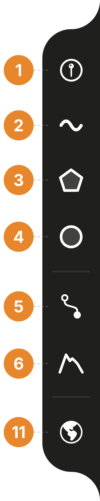
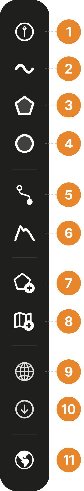
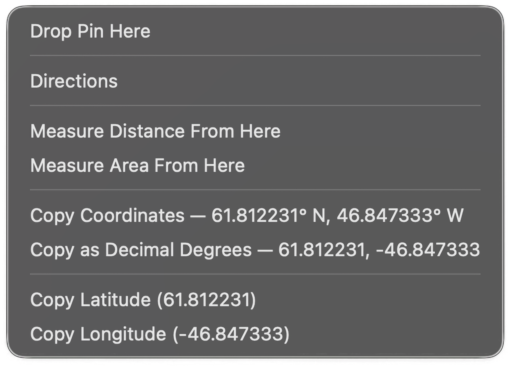

Everything you do directly on the map starts in the **tool sidebar**, a vertical strip of buttons beside the map. :ios[On iPhone it is pinned to one edge of the screen.] :mac[On Mac it is always on the left — hard against the window edge, or just clear of the floating panel when the panel is on that side — and vertically centred, moving above the elevation profile panel while one is open.]

On iPhone, long-press any button to reveal its name; on Mac, hover for a tooltip. :ios[The tool sidebar's position, size, and visibility are adjustable in **Settings → Toolbar** (see [Map UI, settings and styling](/manual/ui-settings-styling/)).]

:::::platforms
:::ios

:::

:::mac

:::

::::legend
1. **Add Point** — marks one location, where you tap or at your current GPS fix.
2. **Add Line** — traces a path, with live length and bearing.
3. **Add Polygon** — outlines an area, with live area and perimeter.
4. **Add Circle** — draws a circle from a centre and an edge point, with a lock that holds the radius.
5. **Create Route** — gets driving or walking directions, savable as a line.
6. **Elevation Profile** — charts elevation along a tapped path or road route.

:::mac
7. **Import Vector** — brings in GPX, KML, KMZ, GeoJSON, or GeoPackage files.
8. **Import Raster** — brings in GeoTIFF imagery or GeoPDF maps.
9. **Add Tile Layer** — connects an XYZ or WMS web base map.
10. **Download Data** — saves the tile layers you have added, and elevation tiles, for offline use.
:::

11. **Base map** — cycles Standard → Hybrid → Satellite → No Map.

::::
:::::

## The shape tools

These tools create vector features on the map: add a point, draw lines and polygons, and read measurements that are easy to copy with a tap. Save the feature with :ui[Save], then set its name, style, description, and photos in the editor that opens. Press :ui[Cancel]{icon=x} instead and nothing is saved.

- :ui[Add Point]{icon=add-point} marks a single location, either where you tap the map or, from the location button on the tool card, where you are standing. Points store photos, descriptions, and elevations, and imported points keep their attributes.
- :ui[Add Line]{icon=add-line} traces a path. While you draw, the tool card shows the running length and the bearing of the last segment.
- :ui[Add Polygon]{icon=add-polygon} outlines an area. The tool card shows live area and perimeter as you tap the corners.
- :ui[Add Circle]{icon=add-circle} takes two taps, a centre and a point on the edge, and shows live radius, area, and circumference. The lock button freezes the radius, so dragging the centre moves the whole circle at that fixed size.

While a tool is active, the [tool card](/manual/interface/#the-map) appears at the bottom of the screen with the live values and the :ui[Cancel]{icon=x} / :ui[Undo] / :ui[Save] actions.

How to draw and edit features is covered in [Points, lines, polygons and circles](/manual/points-lines-polygons/); how the numbers are computed and how far to trust them is covered in [Measuring](/manual/measurement/).

## Route and elevation

- :ui[Create Route]{icon=create-route} gets driving or walking directions between two points from Apple Maps routing and draws them on the map. A saved route becomes a line in your project and works offline like any other feature. See [Directions and routing](/manual/directions-and-routing/).
- :ui[Elevation Profile]{icon=elevation-profile} charts elevation along a path you tap out, or along a road route it follows for you, with gain, loss, and min/max, from a global 30 m elevation model. See [Elevation and DEMs](/manual/elevation/).

## Importing data

:::mac
On Mac, files come in three ways: the tool sidebar's :ui[Import Vector]{icon=import-vector} and :ui[Import Raster]{icon=import-raster} buttons, the **Layers** tab's :ui[plus]{icon=plus} menu, and dragging files onto the window. All three accept the same formats — the two buttons open the system Open dialog, and dragging skips only that.
:::

:::ios
On iPhone, files come in through the **Layers** tab's :ui[plus]{icon=plus} menu, or through **Open With → TopoKit** from the **Files** app or a Mail or Messages attachment.
:::

For what file formats TopoKit supports, see [File formats at a glance](/manual/file-formats/), then [Vector import and export](/manual/vector-import-export/) or [Raster overlays](/manual/raster-overlays/).

## Tile layers and offline downloads

- :ui[Add Tile Layer]{icon=add-tile-layer} connects a background map from a web service you choose: a government WMS service, or any XYZ tile URL. See [Tile layers](/manual/tile-layers/).
- :ui[Download Data]{icon=download-data} saves tiles to this device for offline use: the tile layers you have added, and elevation tiles for profiles and point elevations. Apple's base map cannot be downloaded. See [Tile layers](/manual/tile-layers/) and [Elevation and DEMs](/manual/elevation/).

:ios[On iPhone, both commands are in the **Layers** tab rather than the tool sidebar.]

## Centring on your location

The location button floats at the bottom-right corner of the map on both platforms, showing a small arrow.

:::ios
On iPhone, the button cycles through three states. One tap centres the map on your position and keeps following it as you move; the arrow fills orange. A second tap also rotates the map to face your heading. A third tap, or panning the map away, turns following off and the arrow returns to its outline.
:::

:::mac
On Mac, the first click turns location on — asking for system permission if it has not been granted yet — and centres the map on your fix; the arrow fills while location is on. The Mac map does not follow you as you move: each further click re-centres once.
:::

If you skipped the location step during onboarding, the first use of this button is what brings up the system permission prompt. Accuracy and permissions are covered in [GPS and track recording](/manual/gps-and-track-recording/).

## The base map button

At the bottom of the tool sidebar, the base map button switches which Apple map is drawn. It is a global preference, shared by all projects.

- :ui[Standard]{icon=map-standard} — the road map.
- :ui[Hybrid]{icon=map-hybrid} — satellite imagery with road and label overlays.
- :ui[Satellite]{icon=map-satellite} — imagery only, no labels.
- :ui[No Map]{icon=map-no-map} — a plain background with only your own layers.

:::mac
## The Mac right-click menu

The Mac map has one more entry point: right-click anywhere to copy the coordinates in several formats. With a project open, the same menu also offers to drop a pin, get directions, or measure distance or area from that spot; without a project, only the copy options appear.

Each copy option shows the value it will put on the clipboard, so you can read the coordinate straight off the menu without copying anything. The full menu is listed in [Map UI, settings and styling](/manual/ui-settings-styling/).
:::

## FAQ

**Why are the tool buttons greyed out?**
No project is open. Tools and imports save what they create into a project, so they stay disabled until you open or create one. The base map button at the bottom keeps working.

**Why don't I see import buttons on my iPhone?**
The iPhone tool sidebar holds map tools only. The import commands are in the **Layers** tab's :ui[plus]{icon=plus} menu, which has room for the multi-step dialogs.

**Can I move or hide the tool sidebar?**
On iPhone, yes: **Settings → Toolbar** moves it to either edge, changes the icon size, or hides it entirely. On Mac it is fixed to the left of the map.
