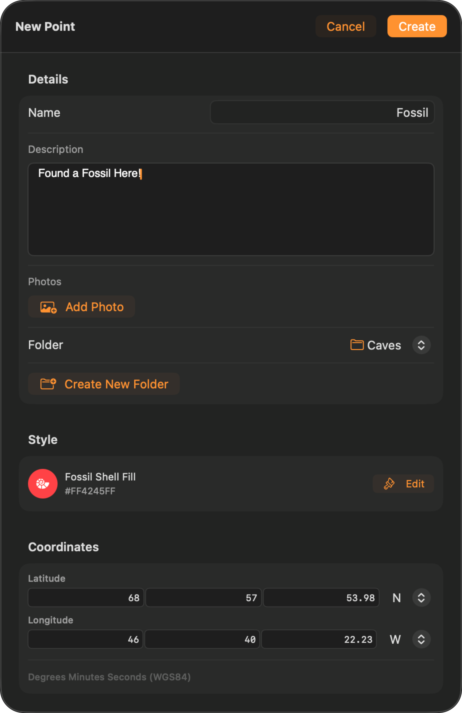

Points, lines and polygons are the three geometry types a TopoKit project stores. Circles are a fourth tool, not a fourth type: a circle is saved as a polygon.

Every vector feature you draw or import is stored in WGS84 (EPSG:4326), the latitude and longitude system GPS uses. The types differ only in how many coordinates they hold and whether the shape closes into a ring. All of them appear in the layer tree, can be styled, and can have photos attached.

## Points

A point marks one location, such as a sample site or a trailhead. It carries a name, a description, photos, an elevation, and a pin style you choose.

### Adding a point

You place the point first. The editor then opens on that spot for the name and the rest of the details. There are three ways to set that location:

- **Tap the map.** Activate :ui[Add Point]{icon=add-point} and tap where you want it.
- **Use your current location.** Tap the :ui[location]{icon=location} button on the Add Point tool card to place the point on your GPS fix. It is only on that card, not in the point editor.
- **Use a search result.** Search for a place or a coordinate and choose :ui[Add Point]{icon=plus} in the result's popover. A result that is already one of your features offers Edit instead.

However you started, the coordinate is editable in the editor before you save, so a rough tap can be corrected to an exact figure. A point placed from your location also stores the whole reading — accuracy, altitude, speed, course, timestamp, and the original lat/lon — so one you nudge afterward can still be traced back to the fix it came from.

### Coordinate entry formats

Coordinate fields follow your preferred format, set in Settings → Units & Coordinates → Coordinate Format. The choice applies everywhere coordinates appear — the GPS tab, search, feature info, and the vertex editors — and TopoKit stores decimal degrees underneath whichever format you pick. Only UTM is coarser on screen: eastings and northings are shown to the whole metre, though the fields accept decimals.

### Editing a point

The editor you fill in when you create a point has three sections: **Details** (name, required; description, photos, folder, and a :ui[Create New Folder]{icon=folder-plus} button), **Style** (pin colour and glyph, with :ui[Edit] for the full customization sheet), and **Coordinates**.

Tap a point that already exists, on the map or in the tree, and the same form opens with three more controls: :ui[Get Elevation], a read-only **Attributes** view, and :ui[Delete], behind a confirmation. Saving differs by platform:

:::mac
On Mac, the popover saves as soon as you dismiss it. There is no Cancel — click outside to commit.
:::

:::ios
On iPhone, only :ui[Done] saves. Swiping the sheet down discards changes to the name, description, coordinate, and folder.
:::

### Attributes are read-only

**TopoKit has no attribute editor.** A feature you draw carries a name and a description, and nothing else you can type. There is no way to add a custom field — no species, sample ID, diameter, or condition column — and no attribute table view.

The Attributes list shows the values TopoKit wrote itself and the columns that arrived with an import: GPS accuracy, altitude, speed, course, and timestamp for a point captured from your location; the `track_*` statistics on a recorded track; and every column of an imported GeoJSON or GeoPackage feature. All of it is display-only. Imported values are preserved verbatim and are written back out on export, and the search bar matches against them, but they cannot be corrected in the app.

If your workflow needs structured attribute capture in the field, collect the geometry in TopoKit, export to GeoPackage, and attribute it in your desktop GIS.

### Photos

Every feature (point, line, or polygon) accepts photos. Tap :ui[Add Photo]{icon=image} in the Details section to open the picker:
:ios[On iPhone, the picker offers :ui[Take Photo]{icon=camera} and :ui[Choose from Library]{icon=image}.] :mac[On Mac, it offers **Choose from Photo Library** and :ui[Import from Files]{icon=import}.] The system photo picker takes at most **10 images per pass** on both platforms — that is a limit on one trip through the picker, not on how many photos a feature can hold, so run it again for more. :ui[Import from Files]{icon=import} and :ui[Take Photo]{icon=camera} have no such limit.

Selected images are capped on their longest edge by the photo-resolution setting — 3024 px at High, 2048 at Medium, 1024 at Low, or uncapped at **Original** — re-encoded as JPEG, and stored in a `Photos/` folder next to your project, with a small thumbnail for the grid. Tapping a thumbnail opens a full-size viewer where you can delete the photo, save it to your Photos library (iPhone), or save a copy to disk (Mac).

Because photos are stored beside the project file, moving a project by hand means copying the whole project folder (see the [Projects and files](/manual/projects-and-files/) chapter). If the photos are left behind, the project keeps the attachment records, but the thumbnails never finish loading — they show a spinner until the files are back. iCloud Drive moves the Photos folder along with the project on its own, because the photos are stored inside the project folder rather than being fetched separately. On a slow connection the map can open with thumbnails still arriving.

### Elevation

The editor has no free-form elevation field. A point's elevation is either fetched from the Copernicus GLO-30 DEM with :ui[Get Elevation], or empty. The altitude that came with a GPS fix is stored separately and shows up in the read-only Attributes list, not in the Elevation section.

- If the DEM tile covering the point is already on the device, :ui[Get Elevation] returns a value instantly (for example `142.3 m`).
- If not, the button reads "Get Elevation (25–40 MB download)" and waits for you to tap before downloading. Downloaded tiles are cached and reused for every feature in that area.
- On open, elevation auto-fills silently only if the covering tile is already cached. There is never a silent download.
- Over ocean, at extreme latitudes, or if a tile cannot be read, elevation shows "Not available" and is not saved.

The full elevation-profile workflow is in the [Elevation and DEMs](/manual/elevation/) chapter.

### Point style and folder defaults

A point's pin style comes from the app default or from the point's own style: there is no live folder default. A new point loads the app default, snapshotted at creation, and you can change its marker tint colour, its glyph, and its glyph colour at any time.

To restyle a whole folder's points together, edit the folder and set its pin style. This applies the chosen style to every point currently in the folder, including points you had styled individually. :mac[On Mac, a single Undo, named Change Folder Symbology, restores the previous styles.] :ios[On iPhone, there is no undo, so confirm the style before you apply it.] Applying a folder's pin style is the same one-time apply-to-all operation used for line and polygon symbology.

A folder style applies to the folder's own features only — anything in a subfolder is left alone, so restyle nested folders separately. And a style row appears only for the geometry types the folder already contains, so you cannot style an empty folder in advance.

Lines and polygons resolve style the same way.

## Lines

You place a line's vertices in order and TopoKit joins them up. A track that breaks into several separate stretches — a recorded GPX track with signal gaps, for instance — is still one line feature, just one with several segments.

### Drawing a line

<video src="/media/points-lines-polygons-line-tool.mp4" autoplay loop muted playsinline aria-label="The line tool in action: placing vertices, tapping back to an earlier vertex so the next one inserts mid-line, and dragging vertices to move them"></video>

Activate :ui[Add Line]{icon=add-line} from the tool sidebar. Like every shape and import tool, it is disabled until a project is open. The [tool card](/manual/interface/#the-map) appears at the bottom of the screen: an instruction and a countdown until you have placed two vertices, then live distance and bearing.

Each map tap adds a vertex, drawn as a dot styled by your vertex settings (colour, size, opacity, shape) and joined by a live line. The vertex you touched last is the **active** one and new vertices insert after it, so you can tap back to an earlier vertex and add mid-line without starting over. :ui[Undo] removes the vertex you placed most recently, whatever its position in the sequence. Drag any vertex to reposition it and the line reshapes as you drag. :ui[Cancel]{icon=x} discards everything and exits; :ui[Save] turns on at two vertices and opens the line editor.

### Finishing and editing a line

Tap :ui[Save] to open the **Line editor**:
- **Details:** name (required), description, photos, folder picker.
- **Style:** colour, width, opacity, and pattern (solid, dashed, dotted).
- **Vertices:** a per-vertex list (collapsed by default for long lines) where you can edit a coordinate, reorder, or delete, down to a minimum of 2.

That per-vertex list is part of the **creation** editor only. After a line is saved, its quick edit has no vertex list; instead, use :ui[Edit Vertices on Map]{icon=add-line}, which hides the drawn line and lets you drag the vertex dots directly. Finishing commits the new shape; cancelling restores the original.

For a **multi-segment line** (an imported GPX track, for example), on-map editing shows and edits the first segment only; the others are preserved untouched.

### Line elevation profile

::::beside{side=right}
<video src="/media/points-lines-polygons-line-elevation-profile.mp4" autoplay loop muted playsinline aria-label="Opening the elevation profile on a saved line: the Elevation Profile button in quick edit, then the profile panel with the chart and its stats"></video>

Quick edit's :ui[Elevation Profile]{icon=elevation-profile} button shows the tile status as its subtitle before you tap: "All tiles cached" with the cached size, or "N tiles to download" with an estimated size range. Tapping it opens the profile panel, headed by the line's name, and starts loading immediately: a progress bar ("Downloading N tiles…") tracks any missing tile downloads while the chart prepares, and if everything is already cached, the chart draws right away. The full profile, hover readout, and stats (min, max, average, gain, loss, distance) are covered in the [Elevation and DEMs](/manual/elevation/) chapter.
::::

### Line style

A line's stroke colour, opacity, width, and pattern are set in the Style section of the editor that opens when you tap :ui[Save], or any time afterward from quick edit.

 A folder's style editor can copy a chosen style onto every line inside it: edit the folder, tap :ui[Edit] on its Style row, and what you set is written onto each line when you tap :ui[Done], rather than acting as a live default.

## Polygons

You tap a polygon's corners and TopoKit closes the ring for you. There is no need to tap back on the first corner to finish.

### Drawing a polygon

The polygon tool uses the same tool card as lines, with three differences: the minimum is **3** vertices, the info section shows **area and perimeter** instead of length, and the overlay fills as a polygon once you reach 3 (below that it is an open outline). Placing, active-vertex insertion, and vertex dragging work exactly as for lines. :ui[Save] closes the ring and opens the polygon editor.

The area shown while you draw is a planar approximation computed on a local tangent plane, so it is fast but its accuracy degrades for very large polygons or ones spanning high latitudes. Perimeter is the sum of geodesic segment distances on the WGS84 ellipsoid. Both follow your units setting. The saved editor does not show area or perimeter, but you do not have to re-trace the shape to get them back: open :ui[Edit Vertices on Map]{icon=add-line} and its tool card shows the vertex count alongside the shape's current area (see the [Measuring](/manual/measurement/) chapter).

### Editing and style

Editing works like lines: a per-vertex list in the **creation** editor, and :ui[Edit Vertices on Map]{icon=add-line} from quick edit after saving. For a **MultiPolygon** or a polygon with **holes**, only the outer ring of the first polygon is edited; the rest is preserved.

The polygon editor matches the line editor's, with fill colour and opacity added to Style and a Vertices list covering the outer ring only.

Photos work exactly as for points.

## Circles

A circle is created with :ui[Add Circle]{icon=add-circle} from a **centre** and an **edge point**, two taps in total. The tool card shows live radius, area, and circumference as you go, plus an optional **radius lock** that freezes the size so you can slide the whole circle around the map. The full measuring workflow is in the [Measuring](/manual/measurement/) chapter.

On save, the circle is stored as a **polygon feature**: a 64-vertex ring, placed with a spherical formula, that approximates the circle on the ground. From then on it behaves exactly like any other polygon: the same editor, styling, folder placement, photos and export. There is no separate "circle" geometry type in the project file, so every export format handles it like any other polygon.

## Moving features between folders

The full mechanics are in the [layer tree](/manual/layer-tree/) chapter:
- In an editor, change the folder picker and save.
- In the tree, drag a row onto a folder (Mac) or use Move to... / Batch Move (iPhone).

A feature in no folder is valid and renders exactly like one inside a folder, and a folder's contents move with it.

A feature's :ui[Create New Folder]{icon=folder-plus} button always creates the new folder at the **root**, but it does not select it: the folder picker stays empty. On a feature you are creating, that means it saves at root level. On one you are editing, saving raises an **Error** alert and the feature stays in the folder it was already in. Either way, move it into the new folder from the tree afterwards. To file a feature into a nested folder, make the folder first in the tree (New Subfolder), then pick it here.

## Platform differences

The gestures differ, and so does undo: `Cmd-Z` exists only on Mac, and even there it does not cover restyling a single feature — only a folder-wide restyle is undoable.

:::ios
On iPhone, editors are full-screen sheets; quick edit is a sheet; the tree uses swipe actions; photos use the system picker or camera. iOS adds haptic feedback on vertex placement, on picking up and dropping a dragged vertex, on the circle's radius-lock button, and on the Edit Vertices on Map tool card's Cancel and Save.
:::

:::mac
On Mac, editors are fixed-width sheets; quick edit is a popover that saves on dismiss; vertex editing uses hover and click; right-click opens context menus; photos use the system picker or a file picker.
:::

## FAQ

**Why can I only edit part of a multi-segment line or MultiPolygon?**
On-map editing works on the first segment or outer ring and preserves the rest. To change the others, export the feature, edit it externally, and re-import.

**Can I style one folder's points differently without editing each point?**
Yes. Edit the folder and set its pin style, and it restyles every point already inside, even ones you styled individually. A point you add afterward still starts from the app default until you reapply the folder style.

**How precise are the stored coordinates?**
Coordinates are stored in full floating-point precision (about 15 significant digits). On screen, decimal degrees are rounded to 6 decimal places (about 11 cm at the equator) for display only; exports (GeoJSON, KML, GPX) write the full stored precision. **Opening a coordinate in the editor and saving it again loses precision in every format**, because the fields are refilled at a fixed number of places: about 11 cm in decimal degrees, 31 cm in DMS, 1 m in UTM, and 1.85 m in DDM, the coarsest of the four. Nothing is lost unless you save; switching format alone never rewrites a coordinate, since everything is stored as decimal degrees regardless.

You can still type finer than the display: the UTM fields accept decimals even though they are refilled to the whole metre. There is no MGRS display or entry format.

**What happens if I delete a folder that has features in it?**
Deleting a folder deletes everything inside it: features, rasters, and any nested folders, all the way down. A confirmation warns you before this happens. :mac[On Mac, Undo restores everything the folder contained.] :ios[On iPhone, there is no undo, so review the contents before you confirm.]
