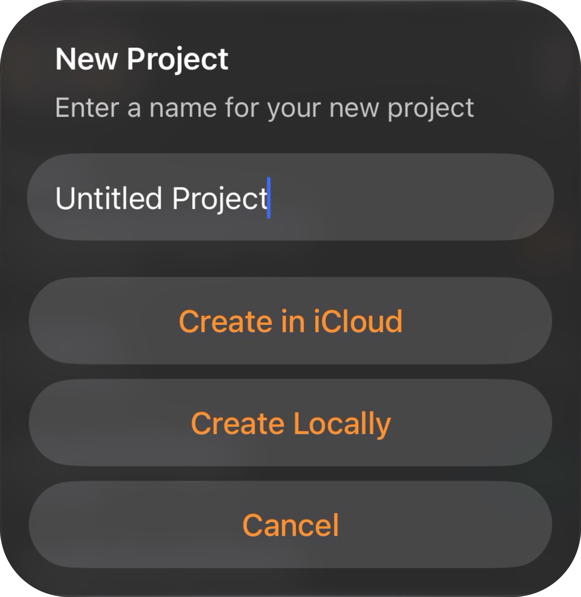
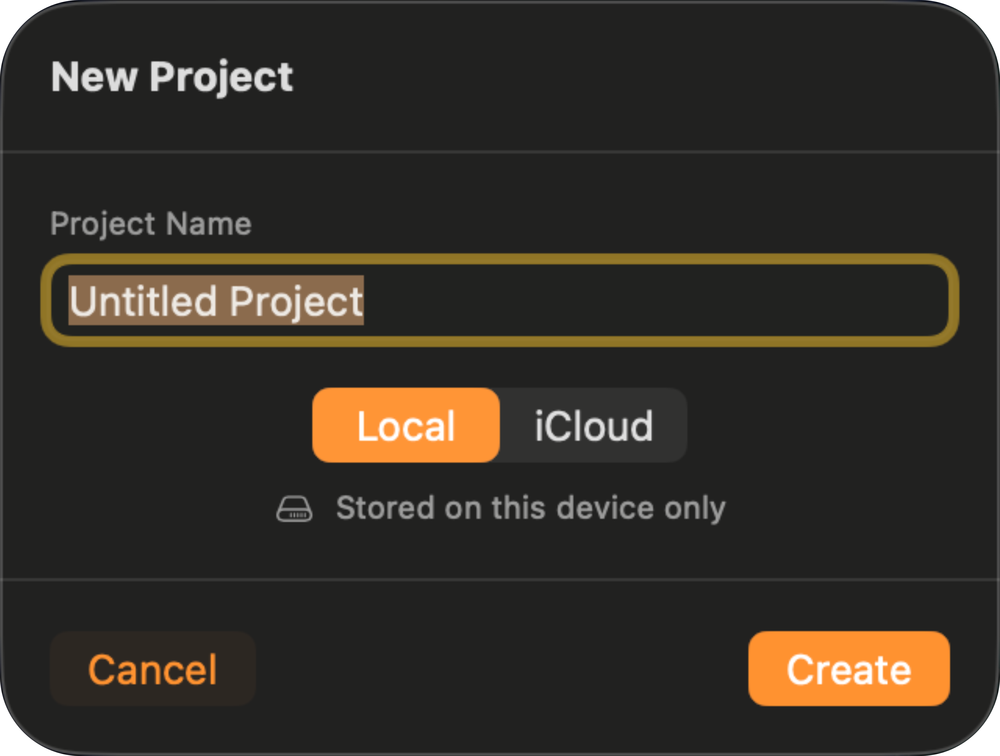
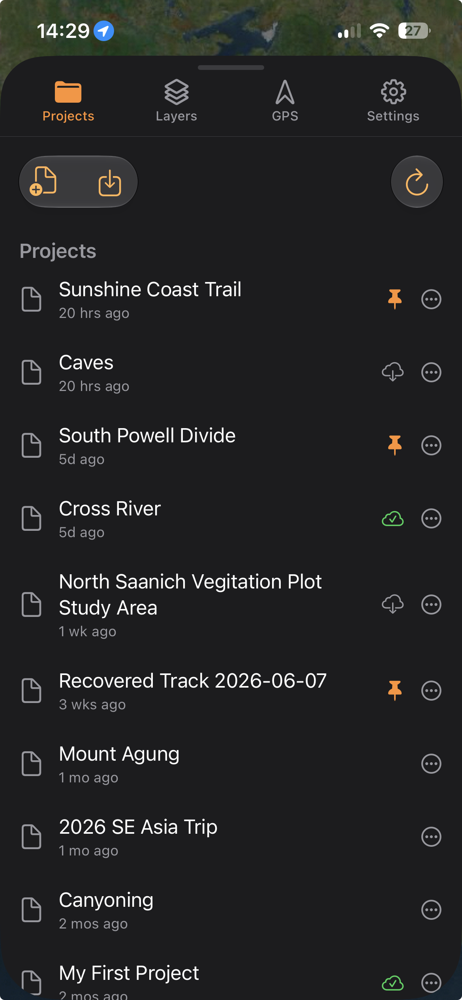

Projects keep all of your data organized. Everything you make or import is added to a project, and includes:

- Points, lines, and polygons
- Raster overlays (GeoTIFFs and GeoPDFs)
- Tile layers (XYZ or WMS servers, with any offline regions you download)
- The folders that organize your layer tree
- Your styling choices (default pin colours, line widths, and so on)

On disk, a project is a folder, named by a unique ID, that holds the project file plus every asset it depends on. Copying, syncing, or backing up the project takes your rasters and photos with it. Tiles you download for offline use are the exception: TopoKit keeps them outside the project folder, so they stay on the device that downloaded them.

```
<projects root>/
  E8A1F3B2-.../             ← the project, in a folder named by a unique ID
    project.mapproject       ← the project itself
    project.mapproject.bak   ← automatic backup of the last good save
    Rasters/                 ← imported GeoTIFF and GeoPDF files
    Photos/                  ← photos attached to features
      thumbs/                ← small preview thumbnails of those photos
```

The `.mapproject` file is plain text (JSON), so you can open it in any text editor to inspect or repair your data by hand. TopoKit works with one project at a time: opening a project automatically saves and closes the one you had open.

## Creating a project

Create a new project from the **Projects** tab. :mac[On Mac, **File > New Project** (`Cmd-N`) does the same.]

Name the project, then choose where it is stored.

:::ios
On iPhone, an alert offers two buttons:

- **Create in iCloud** — the project syncs to all your devices.
- **Create Locally** — the project stays on this device only.


:::

:::mac
On Mac, the sheet has a storage picker:

- **Local** — stays on this device only. Selected by default.
- **iCloud** — syncs to all your devices.


:::

If you are not signed in to iCloud, projects are created locally. You can move a project between iCloud and local storage later without losing anything — see [Renaming, moving, and deleting](#renaming-moving-and-deleting).

## Opening a project

There are three ways a project opens:

**From the Projects tab.** Selecting a project row opens it. If it is stored in iCloud but hasn't downloaded to this device yet, TopoKit starts the download and shows its progress; if the download does not finish within 60 seconds, an error appears.

**From a file.** Opening a `.mapproject` from Files, Finder, AirDrop, email, or Messages opens it in TopoKit. **Import Project** in the Projects tab does the same for a file you pick yourself, except that TopoKit copies it into a new project first and opens that copy.

**Automatic resume.** TopoKit reopens your last project on launch. If that project is in iCloud and hasn't downloaded to this device yet, TopoKit starts the download and opens it once it arrives; if the download can't finish, the project list opens; select the project to try again.

Data files in other formats work the same way when you open them in TopoKit from another app: they import into whatever project is open, and if none is open, the file is imported as soon as you open one. Which formats are accepted is covered in [File formats at a glance](/manual/file-formats/).

### Recovery on launch

If the project TopoKit tries to resume will not parse, TopoKit falls back to the `.bak` and opens the project at its previous good save. If the `.bak` is unreadable too, the project list opens instead of a crash. [Corruption recovery](#corruption-recovery) describes the checks in full.

## Renaming, moving, and deleting

Every project in the list has a :ui[More]{icon=ellipsis} menu at the end of its row:

- **Rename** leaves the folder on disk under its ID name, so nothing else about the project changes.
- **Move to iCloud** and **Move to Local Storage** copy the whole project folder, rasters and photos included, to the other location, then remove the original.
- **Save Offline** and **Remove Offline Copy** keep a full local copy of an iCloud project, or remove that copy again. They appear only on projects stored in iCloud, and are covered under [Offline pinning](#offline-pinning).
- **Delete** asks you to confirm, then deletes the whole project folder, rasters and photos with it. This cannot be undone.

:::mac
On Mac, the menu also offers **Show in Finder**, which selects the project's ID-named folder inside `Projects/`.
:::

:::ios
On iPhone, the menu also offers **Zoom to Project Extent**, which fits the map around everything in the open project. It appears only on the project you have open.
:::

## Saving

You never have to save manually. TopoKit autosaves every edit.

Every change to project data marks the project for saving, and two seconds after your last change TopoKit writes to disk. The current project's card at the top of the Projects tab has a **Save** button that writes right away. :mac[On Mac, **File > Save** (`Cmd-S`) does the same.]

### Atomic writes and the .bak backup

Every save happens in two steps:

1. TopoKit first copies the current `project.mapproject` to `project.mapproject.bak`, a rolling, one-deep backup of your last good save.
2. It writes the new data to a temporary file, then swaps it into place in a single step. The file on disk is therefore always either fully the old version or fully the new one, never half-written.

Because the backup is made before the new write begins, the `.bak` is always your previous successful save. If you keep editing while a save is running, those edits are captured by the next autosave rather than lost, and saves never overlap.

## Corruption recovery

A `.mapproject` can become unreadable if the filesystem truncates it or a hand-edit produces invalid JSON. When TopoKit opens a project it runs three checks:

1. **Does it parse as JSON?** If not, TopoKit falls back to the `.bak`.
2. **Does it decode into a project?** If not, TopoKit falls back to the `.bak`.
3. **Is the layer tree consistent?** TopoKit checks for orphaned nodes, broken parent-child links, cycles, and duplicate IDs. These it repairs in place rather than falling back — on load, and again before every save.

If the `.bak` is used, the bad primary is renamed to `project.mapproject.corrupt` and kept next to the project for inspection; the project opens at its previous good state. If both files are unreadable, TopoKit reports an error and leaves everything untouched so you can inspect the files yourself.

## iCloud sync

iCloud syncs a project between your iPhone and your Mac. It is the only automatic transfer in the app: save a project to iCloud and it appears on your other devices; keep it **Local** and it stays on the one device that made it. If you plan to work across both, choose iCloud when you create the project.

- Sync runs on your own iCloud account, through Apple, with no TopoKit account and no TopoKit server.
- Sync uses your own iCloud storage, the same allowance as your photos and backups. Projects with large rasters can run to gigabytes, so check your remaining space if you work with a lot of imagery.
- A project stored in iCloud is not necessarily downloaded to the device you are holding. Only pinning guarantees it is on the device when you are somewhere without a signal — see [Offline pinning](#offline-pinning).

TopoKit keeps projects in its own iCloud container, the folder you see under **Files > Browse > iCloud Drive > TopoKit**.

### Sync mechanism

Sync runs through the operating system's file-syncing, not through any TopoKit server:

- You save on device A, and the file uploads to iCloud in the background.
- iCloud delivers the file to device B; the OS downloads it and TopoKit marks that project for reload.
- The next time you view that project on device B, a banner offers to reload the newer version.

TopoKit never auto-reloads while you are editing, since that could overwrite in-progress work. If you had unsaved changes, it confirms before replacing anything.

### Conflicts

If two devices edit the same project offline and then both sync, iCloud reports a conflict and TopoKit keeps every version: the newest version becomes active, and every other version is saved beside it as a timestamped backup (`project (conflict 2026-04-15 14-32).mapproject`). Nothing is deleted, and you can open any backup to compare or merge by hand.

### Rasters and photos

Photos are always stored inside the project folder, so they are copied and synced with the project. Rasters are not, unless you copy them in.

Importing a raster into an iCloud project asks where to keep it. :ios[On iPhone, **Copy into project (syncs via iCloud)** puts the file in the project's `Rasters/` folder, and **Reference only (this device only)** leaves it where it is.] :mac[On Mac, **Copy into Project** puts the file in the project's `Rasters/` folder, and **Reference Only** leaves it where it is.] A referenced raster is not part of the project folder, so it does not sync and it is left behind if you copy or zip the project directory. Importing into a local project asks nothing and always references. You can copy a referenced raster in later with :ui[Copy to iCloud] in **Edit Raster**.

One exception: if the raster needs CRS reprojection, this prompt does not appear. The **Reprojection Required** sheet has its own **Copy into Project** toggle instead.

When you open a project whose rasters haven't finished downloading from iCloud, a banner shows the download progress. Any file that never arrives triggers a warning banner in the layer tree — "3 raster file(s) not found" — listing each missing file with a :ui[Re-link…] button beside it so you can point TopoKit at the file's new location.

### Offline pinning



Pin a project before you go anywhere without a signal. An iCloud project is only guaranteed to be on the device you are holding once you pin it: pinning keeps a full local copy of the project folder, the JSON plus every raster and photo, updated on every save. Unpinning removes that local copy and leaves the iCloud version untouched.

Pin from the project's row in the Projects tab: open the row's :ui[More]{icon=ellipsis} menu and choose **Save Offline**. A pinned project shows an orange pin; the Projects tab also shows whether each project is downloaded, downloading, or still cloud-only. Moving a pinned project to local storage clears its offline pin; the project is on the device either way. Move it back to iCloud and it returns unpinned, so choose **Save Offline** again before you go somewhere without a signal.

## The project file

Everything except your rasters, photos, and downloaded offline tiles is in the `.mapproject` file: the project's name and dates, your styling defaults, and a tree of every layer and folder. It looks like this:

```json
{
  "id": "UUID",
  "name": "My Survey",
  "createdAt": "2026-04-01T09:00:00Z",
  "modifiedAt": "2026-04-18T14:22:11Z",
  "fileFormatVersion": 1,
  "nodes": [ "UUID", { ... }, "UUID", { ... } ],
  "rootNodeIDs": [ "UUID", ... ],
  "tileLayers": [],
  "defaultPinCustomization": { ... }
}
```

`nodes` is a lookup keyed by node ID, written as a flat array that alternates ID string and node object rather than as a JSON object. To find a node by hand, look for its ID as an array element, not as a key.

The file records the version of the project *format* it was written in. If it came from a newer format version than the copy of TopoKit you are running, TopoKit tells you to update rather than opening it partially and quietly dropping whatever it does not understand.

A raster copied into the project is recorded by a relative path (`Rasters/my-geotiff.tif`) rather than an absolute one, since absolute paths differ on every device. So the whole folder can move between devices and still work. A raster you only referenced keeps its absolute path, which is why it is not found on the other device.

## File locations

To copy a project out or back it up by hand, the folders are:

:::ios
On iPhone:

- iCloud: `Files > Browse > iCloud Drive > TopoKit > Projects > <ID>/`
- Local: inside TopoKit's private app storage, which iOS does not expose in the Files app. To get a local project off your iPhone, move it to iCloud first.
:::

:::mac
On Mac:

- iCloud: `~/Library/Mobile Documents/iCloud~ns~TopoKit/Documents/Projects/<ID>/`
- Local: `~/Library/Containers/ns.TopoKit/Data/Library/Application Support/ns.topokit/Projects/<ID>/`
:::

Whenever you copy a project by hand, copy the whole folder (the ID-named directory), not just the `.mapproject` file, or its rasters and photos are left behind. Copying the folder is enough for photos and for rasters you copied into the project, but a **referenced** raster was never in the folder to begin with, so it stays behind however much of the directory you copy — copy it into the project first if you need it on the other device.

## FAQ

**I opened my project on another device and it's not there yet. Why?**
iCloud sync is asynchronous: the file uploads from one device and downloads to the other before it appears, which is seconds on good Wi-Fi but minutes on a poor connection. The Projects tab shows each project's iCloud status; tap a project that hasn't downloaded yet to start the download.

**What happens if I edit on two devices at once?**
Both save their own version, and when iCloud reconciles them TopoKit keeps the newest active and saves the other as a timestamped backup right next to the project. Nothing is lost; open the backup to see the other device's version and merge by hand.

**Can I email a project?**
Yes. **Export Project** in the Projects tab writes the open project's `.mapproject` file wherever you choose, and that file on its own is enough when the project has no rasters or photos, because the export contains neither. To send those as well, zip the whole project folder instead (see [File locations](#file-locations)). Zipping does not pick up referenced rasters, which are stored outside the folder, so copy those into the project before you zip if the recipient needs them.

**What's the .bak file?**
A one-deep backup of your previous successful save. TopoKit makes it automatically before each save and falls back to it if the main file ever becomes unreadable. You can ignore it.

**I see project.mapproject.corrupt next to my project. What is it?**
TopoKit found the main file unreadable, recovered from the `.bak`, and set the bad file aside for inspection. Your project loaded from the backup. Delete the `.corrupt` file, or keep it to send to support.

**Is my project safe if I force-quit while it's saving?**
Yes. Writes are atomic, so the file on disk is always fully old or fully new, and the `.bak` is written before the new save starts.

**I deleted a project by accident. Can I get it back?**
Deleting removes the whole project folder. If it was in iCloud Drive, check **Recently Deleted**; iCloud keeps deletions there for 30 days. Local-only projects have no trash, so deletion is permanent.
