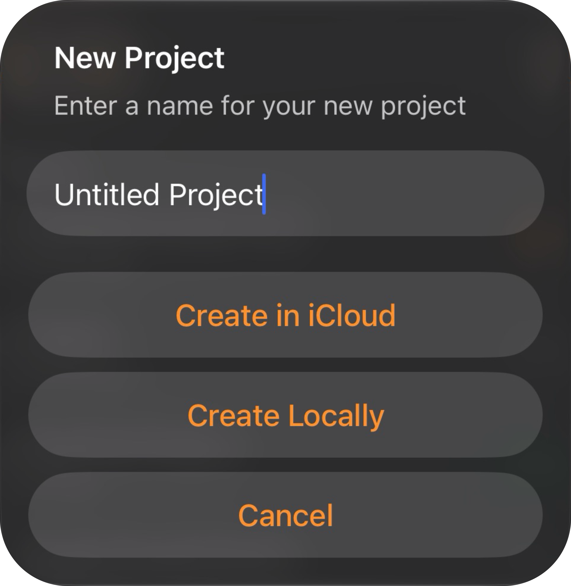
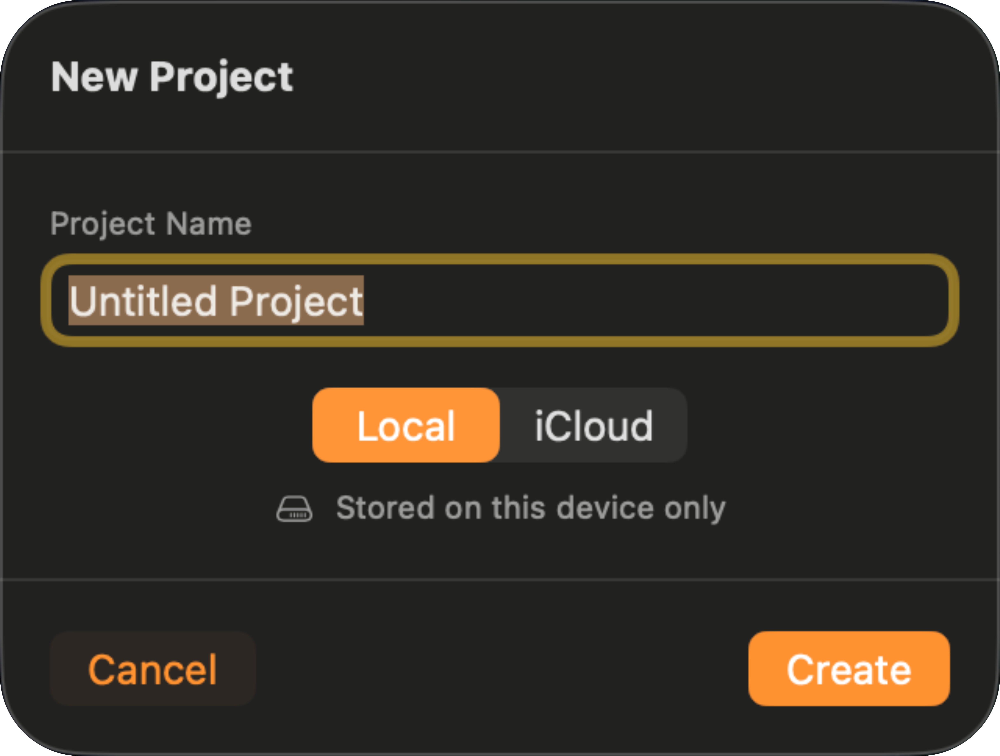
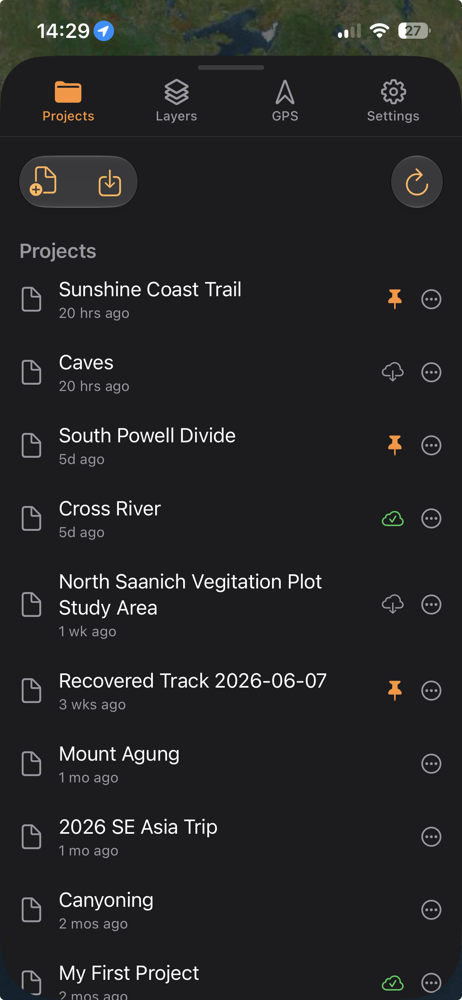

A project holds the points, lines, polygons and circles you draw, saved routes and tracks, raster overlays, tile layers with their download areas, the basemaps you build with their build settings, the folders of the Layers tab, each feature's style, and photos.

On disk a project is a folder named by a unique ID, holding `project.mapproject` and the files it depends on, so copying, syncing or pinning the folder takes its rasters and photos with it. Downloaded offline tiles, downloaded elevation data and the map data of basemaps you build are kept outside the folder, on the device that downloaded or built them ([Other projects and other devices](/manual/basemaps/#other-projects-and-other-devices)).

```
<projects root>/
  E8A1F3B2-.../                           ← the project, named by a unique ID
    project.mapproject                    ← the project itself, plain-text JSON
    project (conflict <date>).mapproject  ← a version set aside by an iCloud conflict
    project (replaced <date>).mapproject  ← the version a restore replaced
    Rasters/                              ← rasters copied into the project
    Photos/                               ← photos attached to features
      thumbs/                             ← preview thumbnails of those photos
```

## Creating a project

Create a project with the new-project button at the top of the Projects tab. New projects are part of the full app; see [What asks you to unlock](/manual/your-topokit/#what-asks-you-to-unlock).

:::ios
On iPhone, the **New Project** alert offers **Create in iCloud** and **Create Locally**. Without iCloud the alert has a single **Create** button, and the project is local.


:::

:::mac
On Mac, the **New Project** sheet selects **Local** by default; the other choice is **iCloud**. Without iCloud the choice is not shown, and the project is local.


:::

## Opening a project

**From the Projects tab.** The tab lists iCloud and local projects together, most recently saved first. If iCloud holds a newer version of a project already on this device, TopoKit waits up to 4 seconds for it, then opens the copy on this device. An iCloud project not yet on this device downloads first, with its progress on the row; if it has not arrived within 60 seconds, TopoKit reports "Project download timed out. Check your internet connection."

:::mac
**From Open Recent.** On Mac, **File → Open Recent** lists up to ten projects opened or created on this Mac, newest first; a `.mapproject` opened from Finder is not added. A project no longer on this Mac is taken off the list when you choose it.
:::

**From a file.** Opening a `.mapproject` from another app opens that file without adding it to the Projects tab, and it cannot be renamed, moved, saved offline, restored or deleted from TopoKit. :mac[On Mac, TopoKit saves your edits back to that file and keeps its backup beside it as a `.bak`.] :ios[On iPhone, to keep a project someone sent you, use **Import Project**.]

**With Import Project.** **Import Project**, at the top of the Projects tab, copies a `.mapproject` or `.json` file you pick into a new project with the same name, in iCloud when iCloud is available, and opens the copy. Only the project file is copied, not the original's rasters and photos, and the copy's new ID means it never merges with the original. :mac[On Mac, **File → Open Project…** (`Cmd-O`) and dropping a `.mapproject` on the window do the same.]

**At launch.** TopoKit reopens your last project unless you closed it. If an iCloud project cannot download, the project list opens; select the project to try again.

## Renaming, moving and deleting

Each row in the Projects tab ends in a :ui[Project options]{icon=ellipsis} menu:

- **Move to iCloud** / **Move to Local Storage**: copies the whole folder, rasters and photos included, to the other location after you confirm, then removes the original. An open project is saved first and stays open; an iCloud project not on this device downloads first. Both appear only while iCloud is available. A project moved to local storage disappears from your other devices.
- **Save Offline** / **Remove Offline Copy**: pins or unpins an iCloud project ([Offline pinning](#offline-pinning)).
- **Restore from Backup**: appears only when TopoKit holds an earlier version ([Restoring an earlier version](#restoring-an-earlier-version)).
- **Delete**: deletes the folder with its rasters and photos, this device's backup of it and its offline copy, after you confirm. An iCloud project is deleted from your other devices too.

## Saving

TopoKit saves every edit two seconds after the last change, and at once when you open another project, create one, or close the open one. :ios[On iPhone, it also saves at once when TopoKit leaves the screen.] :mac[On Mac, it saves when you quit, and closing the window quits; quitting waits up to ten seconds for the save.]

On the project card at the top of the Projects tab, an orange dot beside the name means changes are waiting for the next save. **Not saved — changed on another device** means saving is paused ([Merging changes from another device](#merging-changes-from-another-device)). If a save fails, the card reads "Save failed:" with the reason, and an automatic save also raises **Autosave Failed**. The reason "Cloud sync is paused for this session" is not a failed save: iCloud could not be verified at launch, so the project is saved on this device and syncs the next time TopoKit opens with iCloud available.

- **Refresh**: reloads the open project from disk; the arrow at the top of the Projects tab only rereads the list. Unsaved changes are merged with the version on disk when nothing clashes; otherwise TopoKit asks.
- **Close**: saves and closes the project. If the save fails, the project stays open and an alert gives the reason. :mac[On Mac, **File → Close Project** (`Cmd-W`) does the same and leaves the window open.]

### What a save does

1. TopoKit checks that the file on disk is still the version this device last opened or saved. If another device's save replaced it, TopoKit merges or asks before writing anything ([Merging changes from another device](#merging-changes-from-another-device)).
2. It copies the current `project.mapproject` to a one-deep backup on this device, outside the project folder. The backup does not sync, so each device keeps its own.
3. It writes the new version to a temporary file and swaps it into place, so the file on disk is always fully old or fully new.

## Restoring an earlier version

**Restore from Backup** lists the earlier versions TopoKit holds, newest first. :mac[On Mac, **File → Restore from Backup** lists the same for the open project.]

- **Last save backup**: the version on disk before this device's latest save.
- **Sync conflict**: a version set aside when iCloud reported a conflict ([Sync conflicts](#sync-conflicts)).
- **Saved copy**: any other `.mapproject` in the project folder, including the copy a restore keeps.

A version that does not read as a project is refused. Otherwise, once you confirm **Restore This Version?**, unsaved edits are saved first, the replaced version is kept as `project (replaced 2026-04-15 14-32-05).mapproject`, and the project reloads; restoring that copy undoes the restore.

## When a project will not open

When TopoKit opens a project, it runs three checks. If the project it resumes at launch fails them, the project list opens.

1. If the file does not parse as JSON, TopoKit falls back to a backup: this device's, or failing that a `.bak` beside the file. If it reads, the bad file is renamed `project.mapproject.corrupt` and the project opens at the backup's version. If the backup does not read, or there is none, TopoKit reports an error and leaves the file alone; open the project on a device that has saved it.
2. If it parses but does not decode into a project, TopoKit leaves the file exactly as it is and reports "TopoKit couldn't read this project. If it was saved with a newer TopoKit on another device, update TopoKit here." The backup is not swapped in, because the file may hold edits from a newer TopoKit; earlier versions are under [Restore from Backup](#restoring-an-earlier-version).
3. In the layer tree, orphaned items, broken parent-child links, cycles and duplicate IDs are repaired in place, here and before every save.

## iCloud sync

iCloud syncs an iCloud project between your iPhone and Mac through your own iCloud account and iCloud Drive, with no TopoKit account or server; a local project stays on the device that made it. While iCloud is off or you are signed out, the Projects tab lists only local projects; the iCloud ones are not deleted and return with iCloud.

An iCloud project is not necessarily downloaded to the device you are holding; only [pinning](#offline-pinning) keeps it there. Photos always sync. A raster syncs only once it is copied into the project ([Rasters and iCloud](/manual/raster-overlays/#rasters-and-icloud)).

If the project is open on another device, **Updated on another device** appears there as soon as a new version arrives, with a **Reload** button that works like the card's **Refresh**. If the project is closed there, opening it merges the arrived version with that device's last save.

### Merging changes from another device

TopoKit never replaces your unsaved changes with another device's version, and never saves over a version it has not loaded. If you have unsaved changes when another device's version arrives, or make one before you reload, automatic saving stops and **Project Changed on Another Device** asks what to do:


- **Merge Changes**: combines both devices' changes and saves. A **Merged** alert says how many changes were kept from each device.
- **Split Into Two Projects**: saves your changes as a new project beside this one, named with "(my changes, Oct 8, 14:32)" added and holding copies of its rasters and photos, and loads the other device's version.
- **Overwrite Their Version**: saves your version over theirs. Theirs is kept as the **Last save backup** until the next save.
- **Decide Later**: keeps your changes on screen, with saving paused.

A merge follows these rules, where an item is any point, line, polygon, circle, folder, raster or layer:

- an item added on either device is kept;
- an item deleted on one device is dropped, unless the other device edited it after the deletion;
- an item edited on both devices takes the newer edit;
- the project's name and other project-level settings come from whichever file is newer;
- reordering or expanding a folder does not count as an edit.

TopoKit remembers a deletion for one year, so a device that has not opened the project for longer than that can bring the item back.

**Save**, the banner's **Reload** and leaving the project merge without asking when no item was edited on both devices. When one was, **Reload** asks **Load version from iCloud?**, and **Save** and leaving ask **Project Changed on Another Device** again.

**Merge Changes** needs this device's record of its last save, which TopoKit keeps only for projects in its own folders; for a `.mapproject` opened from elsewhere, use **Split Into Two Projects**.

:ios[On iPhone, if TopoKit leaves the screen before you choose, your changes are saved as a separate "(my changes, …)" project and the original shows the other device's version.] :mac[On Mac, if you quit before you choose, your changes are saved as a separate "(my changes, …)" project.]

### Sync conflicts

If two devices save the same project while neither can reach iCloud, iCloud reports a conflict once both sync. TopoKit makes the newest version active, saves every other version beside it as a `(conflict <date>)` copy, and names each in a **Project Sync Conflict** alert. Nothing is deleted, and each copy is listed as **Sync conflict** under [Restore from Backup](#restoring-an-earlier-version).

### Devices on different versions

Update TopoKit on every device that syncs a project before editing it on more than one. While one device is still on 1.1:

- TopoKit 1.1 neither checks the file before saving nor merges, so an edit there is saved over another device's version without asking.
- A save from 1.1 drops 1.2's record of deleted items.
- A save from 1.1 removes a basemap's build settings from the project. TopoKit 1.2 keeps a copy of them on each device that has opened or saved the project, and writes them back on its next save.

## Offline pinning



Pinning keeps a full copy of an iCloud project folder, rasters and photos included, on this device, so the project opens with no connection. The row shows a spinner while the copy is made, then an orange pin; a green cloud with a check marks a project that is downloaded but not pinned. The copy is refreshed only when this device saves the project, so another device's edits reach it once you have saved here.

:mac[On Mac, **File → Save Offline** pins the open project.] Moving a pinned project to local storage clears its pin, and moving a project into iCloud pins it.

Turning off **Keep All Projects Offline** in [Settings → Storage & iCloud](/manual/settings/#storage--icloud) removes every offline copy, including those of projects you pinned one by one.

## The project file

The `.mapproject` file holds the project's name and dates, the style of each feature, and a tree of every layer and folder. TopoKit writes it as a single line with its keys in alphabetical order.

`nodes` is a lookup keyed by item ID, written as a flat array that alternates an ID string and an item object, so search for an ID as an array element, not a key. `deletedNodes` holds each deleted item's ID with its deletion date, for [merging](#merging-changes-from-another-device).

`fileFormatVersion` records the format the file was written in. TopoKit 1.2 still writes format 1 ([Devices on different versions](#devices-on-different-versions)).

A raster copied into the project is recorded by a path relative to the project folder, such as `Rasters/my-geotiff.tif`, so the folder can move between devices; any other raster keeps an absolute path on this device.

## File locations

:::ios
On iPhone, an iCloud project is in **Files → Browse → iCloud Drive → TopoKit → Projects**. A local project is in TopoKit's private storage, which the Files app does not show; move it to iCloud to get it off the iPhone.
:::

:::mac
On Mac, **Show in Finder** opens the folder. The paths are:

- iCloud: `~/Library/Mobile Documents/iCloud~ns~TopoKit/Documents/Projects/<ID>/`
- Local: `~/Library/Containers/ns.TopoKit/Data/Library/Application Support/ns.topokit/Projects/<ID>/`
- Last save backup: `~/Library/Containers/ns.TopoKit/Data/Library/Application Support/ns.topokit/SaveBackups/<ID>.mapproject.bak`
:::

## FAQ

**My project isn't on my other device. Why?**
Move a local project to iCloud; both devices need iCloud Drive, which **Settings → Storage & iCloud** shows as **Connected**.

**How do I send a project to someone?**
**Export Project**, at the top of the Projects tab while the project is open, writes the project file alone, without rasters, photos or downloaded data; the recipient uses **Import Project**. To include rasters and photos, zip the project folder ([File locations](#file-locations)). For a colleague without TopoKit, export the layers ([Exporting and sharing](/manual/import-and-export/#exporting-and-sharing)).
