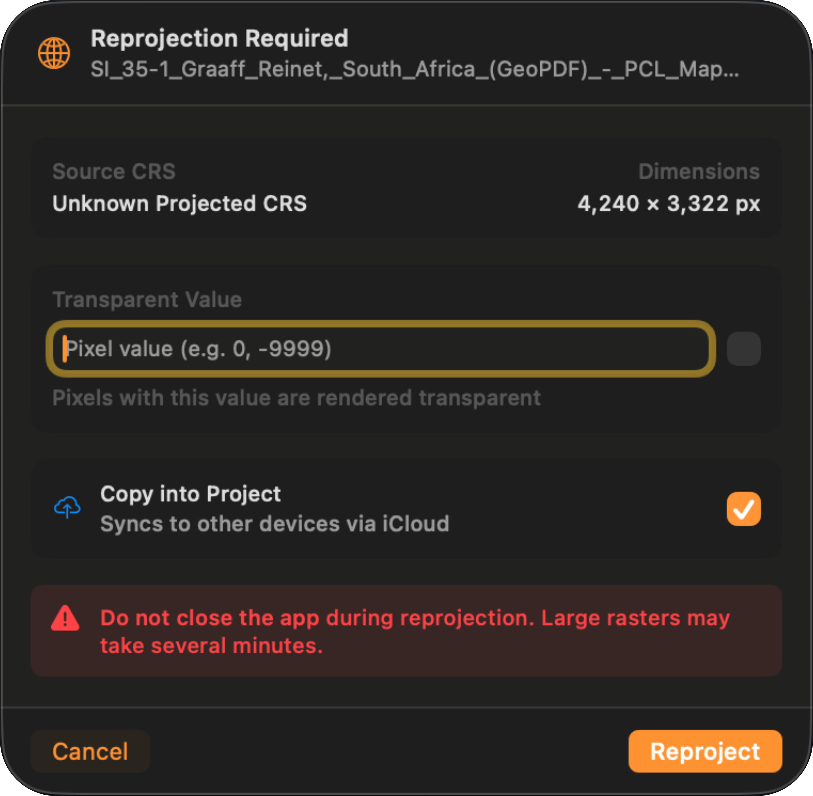
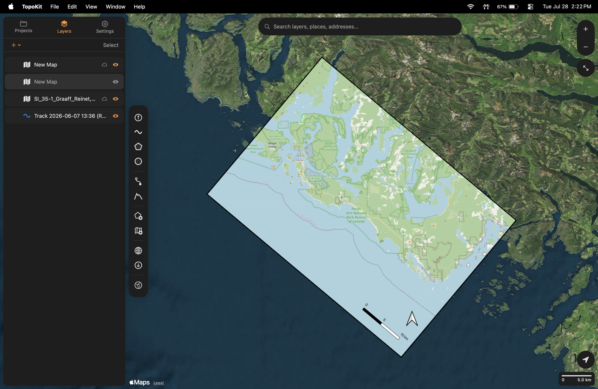
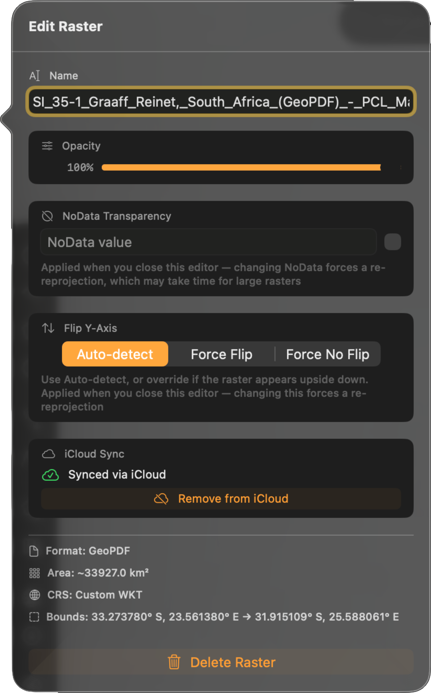

A raster overlay is a map image with its real-world position stored inside the file, such as an aerial photo, a scanned survey sheet, or a hillshade. TopoKit reads that position and draws the image on the base map, under or over your own [points, lines and polygons](/manual/points-lines-polygons/) depending on where you put it in the [layer tree](/manual/layer-tree/).

TopoKit accepts two [source formats](/manual/file-formats/#raster-overlays):

- **GeoTIFF** (`.tif`, `.tiff`, including BigTIFF): the standard interchange format for georeferenced raster data.
- **GeoPDF** (`.pdf`): a PDF with its map position embedded, such as a published topographic sheet.

## Importing a raster

:::mac
On Mac, import a raster with :ui[Import Raster]{icon=import-raster} in the [tool sidebar](/manual/interface/), with **Add Raster (TIFF/PDF)** in the **Layers** tab's :ui[plus]{icon=plus} menu, or by dragging files onto the map. Double-clicking a supported file in Finder also opens it.
:::

:::ios
On iPhone, tap :ui[plus]{icon=plus} in the **Layers** tab and choose :ui[Add Raster]{icon=import-raster}, then pick the file from the Files picker. A supported file also opens from Mail, Messages, or Files with **Open With → TopoKit**.
:::

Many rasters appear on the map right away. If the file needs reprojecting first, the **Reprojection Required** sheet appears next.

## The reprojection sheet

The sheet is titled **Reprojection Required**. It shows what TopoKit read from the file — **Source CRS**, which reads "Unknown Projected CRS" when no EPSG was detected, and **Dimensions** — and offers two settings:

- **Transparent Value**: which pixel value is drawn transparent. This is the same setting Edit Raster calls NoData Transparency, and setting it here saves a re-reprojection later. See [NoData](#nodata).
- **Copy into Project**: copies the source file into the project's folder so it syncs with the project. The row appears only on iCloud projects, and it is the same setting Edit Raster calls iCloud Sync. See [Embedding to iCloud](#embedding-to-icloud).

The buttons are **Cancel** and **Reproject**; when several rasters are waiting, **All (N)** approves every pending raster so you answer the sheet once.

## Coordinate systems

TopoKit needs an EPSG code before it can place a raster.

For a GeoTIFF, the code must be embedded in the file's GeoTIFF keys — UTM zones written as "user-defined" still resolve. A GeoTIFF's embedded WKT text is never read, so adding an `AUTHORITY["EPSG","XXXX"]` clause will not help; re-tag the file in your desktop GIS and re-import. A GeoTIFF with no EPSG code at all is reported as unrecognized and imported disabled.

For a GeoPDF, the coordinate system is a text description. TopoKit accepts an explicit `EPSG:` prefix or an `AUTHORITY["EPSG","XXXX"]` clause, and recognizes many common named projections from the description — UTM zones, State Plane, and a range of national grids. A file it cannot match imports disabled.

There is no in-app CRS picker: the source coordinate system is read-only everywhere it appears, and a guessed coordinate system would produce an overlay that looks correct and is silently offset. An imported raster that is not yet on the map is in one of two states:

- **Imported but switched off.** No coordinate system could be resolved, and the import alert ends "The layer was imported but is disabled" with an **Unsupported Coordinate System** or **No Georeference Found** warning. The layer appears in the [layer tree](/manual/layer-tree/) with its eye off; correct the source file and re-import.
- **Waiting on the reprojection sheet.** The coordinate system resolved but the raster needs reprojecting. Approve the sheet and it draws.

## How reprojection works

Everything in TopoKit draws in Web Mercator (EPSG:3857), so every raster has to line up in that coordinate frame.

A raster already in Web Mercator, or in plain latitude/longitude (EPSG:4326, 4269, or 4258), is drawn straight from its source file — except a GeoPDF with four or more control points, which always reprojects (see [Control points](#control-points)). Every other projection is reprojected once, and the result is cached. TopoKit uses [PROJ](https://proj.org) for the projection math, so almost anything with an EPSG code works; near-polar imagery above about 85° is clipped at the Mercator latitude limit.

### Datum accuracy

Historical datums such as NAD27 and ED50 are transformed without grid corrections, so they can land a metre or two off, varying by region. For rasters, WGS84 (4326), NAD83 (4269) and ETRS89 (4258) are treated as the same system, and [NAD83 and WGS84 have drifted](https://www.ngs.noaa.gov/CORS/Articles/WGS84NAD83.pdf) one to two metres apart in North America, further outside the continental US. If an overlay has to line up with survey-grade control, transform it in your desktop GIS before importing.

### Reprojection quality

Output size comes from the app-wide **Raster Reprojection Quality** setting, **High** unless you change it ([Settings → Data Defaults](/manual/ui-settings-styling/#data-defaults)).

| Setting | Max dimension | Effect |
|---------|---------------|--------|
| Low | 2048 px | Fastest to reproject and smallest on disk. Anything above the cap is averaged down and stays soft however far you zoom in. |
| Medium | 4096 px | A quarter of High's pixel count, with the same softening above the cap. |
| High | 8192 px | Only sources over 8192 px are softened. |
| Original | no limit for GeoTIFFs | Nothing is averaged down for a GeoTIFF. A GeoPDF is still capped near 8000 px, about the same as High. Slowest to reproject, and the largest cache on disk. |

Changing the setting affects rasters you have not reprojected yet. A GeoPDF placed by control points is redone the next time you open the project; any other raster that already reprojected keeps its cached result — to redo it at the new setting, clear the reprojection cache in [Settings → Storage & Cache](/manual/ui-settings-styling/#storage-and-cache).

### Reprojection time

Reprojection runs once per raster per device: under a second for a small sheet, several minutes for a large one at a high quality setting. Leave the app open until it finishes — an interrupted reprojection starts over.

:::ios
On iPhone, TopoKit must also stay in the foreground until the progress indicator finishes — if iOS suspends the app, the work is lost.
:::

### Rotation and skew

A rotated or skewed raster is drawn in its true orientation, as a tilted quadrilateral on the map — whether or not it needed reprojecting.

## GeoPDF import

TopoKit reads the georeferencing embedded in a GeoPDF, including published and scanned topographic sheets. A sheet with a locator inset is georeferenced to the main map, not the inset. If no georeference is found, the PDF still imports, disabled, with a **No georeference found in PDF** warning.

Where a PDF has several pages, TopoKit takes the georeference from the first page that yields one, but always draws page 1. Split a multi-page PDF and import each page separately.

### Control points

A **control point** pairs a spot on the PDF page with a spot on the Earth. The number of control points determines how the PDF is placed:

| Control points | How the PDF is placed |
|---|---|
| Two or three | In Web Mercator or plain latitude/longitude, drawn straight from the source: sharp at any zoom, never clipped. In any other coordinate system it reprojects and caches like everything else. |
| Exactly four | Reprojected and cached: the edges of a wide-area sheet are straightened, and two diagonal corners may be trimmed. |
| Five or more | Reprojected and cached: the edges of a wide-area sheet stay bowed, and nothing is trimmed. |

### Edge clipping

Import a published topographic quad and the margin around the map is cut off, taking the title block, legend, scale bar, and tick labels with it. **Only the map interior of a topographic sheet is georeferenced** — the collar outside the neatline, the rectangular rule around the map area, has no position on the ground and cannot be placed on a map. On a typical published sheet the control points sit on the neatline corners, so that is where TopoKit cuts.

Two causes can cut more than they should:

- **The control points were registered inside the map area.** Some producers register at the tick marks rather than the outermost corners, so the clip shaves tick labels or a sliver of terrain. Re-register the source at the outermost corners.
- **Two diagonal corners are shaved during reprojection.** A sheet placed by exactly four control points forms a slight trapezoid once reprojected, and TopoKit clips to the largest rectangle inside it — typically 100–200 metres off two corners of a 7.5-minute quad. This cannot be turned off.

## Caching

Every successful reprojection is saved to disk and reused.

- **First open is slow, then instant afterwards.** That holds even across closing and reopening the project.
- **Each device reprojects once.** Disk caches do not sync through [iCloud](/manual/projects-and-files/#icloud-sync), so a project opened on a second device reprojects there too.
- **Editing NoData or Flip Y-Axis re-runs the reprojection**, so the change can take a moment to appear on a large raster.

The cache is capped at 2 GB on both platforms. When it fills, the oldest results are evicted first, except for rasters in the project you currently have open — so a large project stays fast, but an old one may reproject again next time you open it. Clear it from [Settings → Storage & Cache](/manual/ui-settings-styling/#storage-and-cache).

## Raster properties and editing

Open a raster's properties from its layer-tree row. :mac[On Mac, right-click the row and choose **Edit**.] :ios[On iPhone, tap the row's :ui[More]{icon=ellipsis} button and choose **Edit**.] The **Edit Raster** panel holds:

- **Opacity**: applied as you drag. The layer's on/off toggle is the eye on its layer-tree row, not here.
- **Render Quality** (GeoTIFF only, default **Full**): caps how sharp the raster is when you zoom in. See below.
- **NoData Transparency**: makes one pixel value draw as transparent, applied when you close the editor. See [NoData](#nodata).
- **Flip Y-Axis**: overrides auto-detection when it guesses a raster's orientation wrong — set **Force Flip** when a raster draws upside down. Applied when you close the editor.
- **iCloud Sync**: copy the raster into the project so it syncs, or remove it from iCloud. See [Embedding to iCloud](#embedding-to-icloud).

Render Quality caps how large the source image is decoded: Fast decodes to 2048 px, Balanced to 4096 px, and only **Full** re-decodes at full resolution, so the difference shows most when you zoom in. It affects rasters drawn straight from their source — a raster that reprojected is drawn from its cached copy instead.

:::ios
On iPhone, a Full-quality decode runs only when the full image fits a budget of roughly 150 MB. Over that, the raster stays at a 4096 px preview and looks soft however far you zoom in — Render Quality cannot fix this, since Balanced decodes to the same 4096 px and Fast to less. Crop the source or reduce its resolution before importing.
:::

:::mac
On Mac, the full-resolution decode completes for anything up to about half the machine's memory.
:::

Below the controls the panel shows what TopoKit read from the file: **Format**, **Area**, **CRS**, and **Bounds**. Apart from the reprojection sheet, this is the only place to read them, and none of them can be edited. The CRS shows an EPSG code, or "Custom WKT" when none was detected. Import diagnostics are listed underneath. That CRS line is the first thing to check when a raster is drawn in the wrong place.

## NoData

NoData is the GIS term for "there is no data for this pixel": the ocean in a land-use map, or holes in a DEM — a **digital elevation model**, a raster whose pixel values are ground heights rather than colours.

**You have to type the value and turn the toggle on. Neither one works by itself.** A freshly imported raster draws those pixels at face value, usually as a black or white block on the map.

Enter the value the unwanted pixels render as — usually `0` for black or `255` for white. The field takes a display value from 0 to 255, not the file's declared NoData, so if your source declares a numeric sentinel like `-9999`, null those pixels out before importing.

A pixel counts as NoData only when all three of its RGB channels equal the value. For RGB imagery where only one channel carries a sentinel, null the pixels out before importing.

TopoKit draws a raster as-is — there is no band selector, contrast stretch, or colour ramp. Render a single-band product such as a DEM or an NDVI grid to 8-bit RGB or greyscale in your desktop GIS first.

## Embedding to iCloud

A raster's source file is in one of two storage modes:

| Mode | Where the file is stored | Syncs via iCloud? |
|------|----------------------|-------------------|
| **Referenced** | An absolute path on the local device (e.g. `~/Documents/Maps/quad.pdf`). | No: the path is local only. |
| **Embedded** | Inside the project's own `Rasters/` folder. | Yes: iCloud Drive copies the file to every device. |

When you embed a raster, from the reprojection sheet or from Edit Raster, the file is copied into the [project's `Rasters/` folder](/manual/projects-and-files/#file-locations) and referenced by a path relative to the project, so the project folder can be moved, renamed or synced without breaking it. The original location is remembered so you can revert to referencing it.

When a project syncs to a new device the project file arrives first and the raster files follow. While a raster is still downloading, nothing is drawn on the map and its layer-tree row shows a download button; the overlay appears when the file arrives.

## Troubleshooting

When a raster doesn't display correctly, check in this order:

1. **Check the file is present.** A missing raster shows a warning badge on its [layer-tree row](/manual/layer-tree/):mac[ — hover it to see which failure it marks]. The layer tree also shows a "raster file(s) not found" banner listing what it can't find, with a **Re-link** button for each. TopoKit auto-repairs the common case by searching for a file of the same name after the project loads. A raster still downloading from iCloud is not an error: its row shows a download button you can tap.
2. **Check the coordinate system was recognized.** There is no badge for this state — the raster is disabled, either at import or after you cancelled the reprojection sheet. If a raster is unexpectedly disabled, that is the likely cause.
3. **Check whether reprojection is still running.** The raster's layer-tree row shows a progress bar captioned "Keep app open!", and an **All (N)** run adds a "Reprojecting rasters…" banner above the tree counting N of M. A large sheet at High quality takes minutes.
4. **Check the bounding box is plausible.** A raster at null island (0, 0) means detection picked the wrong EPSG or the axis order is reversed.
5. **Check for the GeoPDF edge-clipping cases.** See [Edge clipping](#edge-clipping). The fix is always on the source-file side.
6. **Check whether the image is upside down.** Y-axis auto-detection guessed wrong on this file; set **Flip Y-Axis** to **Force Flip** in Edit Raster.

## FAQ

**Why are the edges of my GeoPDF cut off?**

Usually nothing is wrong — only the map interior of a published sheet is georeferenced, so the collar is cut at the neatline. See [Edge clipping](#edge-clipping) for the two cases that cut more than they should.

**Why does the app say the coordinate system is unknown when my file has it embedded?**

See [Coordinate systems](#coordinate-systems): a GeoTIFF's code has to be in its GeoTIFF keys, and a GeoPDF description without an explicit EPSG code may not match a recognized projection. A sidecar `.prj` is not read on either format. Re-tag the source — [`gdal_translate -a_srs EPSG:XXXX`](https://gdal.org/en/stable/programs/gdal_translate.html) is the usual way — and re-import.

**My GeoTIFF has a WLD/TFW sidecar. Does the app use it?**

No. World files are not read — write the transform into the TIFF before importing.

**Why doesn't my raster appear after I moved the file?**

Referenced rasters store an absolute path, so moving the file breaks it. Move the file back, re-import it, or embed it into the project, which uses a relative path and survives moves. See [Embedding to iCloud](#embedding-to-icloud).

**Why is the reprojected image blurry?**

Output is capped by **Raster Reprojection Quality** (default High = 8192 px), and a source larger than the cap is averaged down. For a GeoTIFF, set the quality to **Original** and clear the reprojection cache in [Settings → Storage & Cache](/manual/ui-settings-styling/#storage-and-cache) so the raster is redone at the new setting. A GeoPDF is capped near 8000 px at every setting, so crop the source to your area of interest before importing instead.
