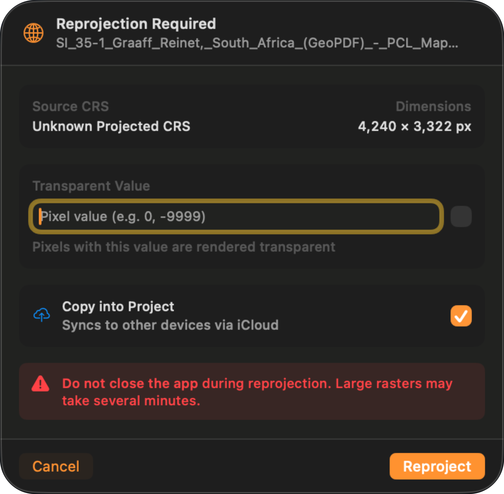

A raster overlay is a map image with its real-world position stored in the file: an aerial photo, a scanned survey sheet, a hillshade. TopoKit reads two formats, **GeoTIFF** (`.tif`, `.tiff`, including BigTIFF) and **GeoPDF** (`.pdf`), and draws the image above or below your points, lines and polygons depending on where its row sits in the Layers tab. Inside its footprint a raster covers the place names and icons of Apple Maps, which show through only where the raster is transparent or its opacity is turned down ([draw order](/manual/layer-tree/#draw-order)). Every other format is in the [formats table](/manual/import-and-export/#formats-at-a-glance).

## Importing a raster

:::mac
On Mac, choose **Add Raster Layer…** from :ui[Add Data]{icon=plus} on the [tool sidebar](/manual/interface/#the-tool-sidebar), from the Layers tab's :ui[plus]{icon=plus} menu, or from the **Layer** menu. Dragging a GeoTIFF or GeoPDF onto an open project's map imports it too. A file opened with TopoKit from Finder or dropped on TopoKit's Dock icon imports the same way, and with no project open it waits until you open one.
:::

:::ios
On iPhone, tap :ui[Add Data]{icon=plus} on the [tool sidebar](/manual/interface/#the-tool-sidebar) or :ui[plus]{icon=plus} in the Layers tab, choose **Add Raster Layer…**, and pick one or more files. A GeoTIFF or GeoPDF opened in TopoKit from Files, Mail or Messages imports the same way, and with no project open it waits until you open one.
:::

TopoKit copies each raster into its own storage on the device, so moving, renaming or deleting the original afterwards does not affect the layer. Importing a raster and opening Edit Raster are part of the full app; rasters already in a project draw and reproject without it ([what asks you to unlock](/manual/your-topokit/#what-asks-you-to-unlock)).

A raster that needs no reprojection appears at once; in an iCloud project it is followed by the **Raster Storage** question ([Rasters and iCloud](#rasters-and-icloud)). One that needs reprojection brings up the **Reprojection Required** sheet.

## The reprojection sheet

**Source CRS** reads "Unknown Projected CRS" when no EPSG code was detected. The sheet has two settings:

- **Transparent Value**: the pixel value drawn transparent once its switch is on. A GeoTIFF that declares its own NoData value arrives with that value filled in and the switch off. Setting it here saves a second reprojection later ([NoData](#nodata)).
- **Copy into Project**: copies the raster into the project's folder so it syncs. The row appears only in an iCloud project, for a raster not already copied in, and its switch starts on ([Rasters and iCloud](#rasters-and-icloud)).

When several rasters are waiting, **All (N)** reprojects each of them in turn with this sheet's settings, so you answer the sheet once.

**Cancel** switches the raster off. :mac[On Mac, to bring the sheet back, right-click the raster's row and choose **Show**.] :ios[On iPhone, to bring the sheet back, tap **Select** in the Layers tab, select the raster, and tap **Show**.]

## Coordinate systems

TopoKit needs to know a raster's coordinate system before it can place it, and the coordinate system is read-only everywhere it appears.

For a GeoTIFF, that means an EPSG code, read from the file's GeoTIFF keys, where UTM zones written as "user-defined" still resolve, or from a `.prj` picked with the image. The GeoTIFF's embedded WKT text is not read. A GeoTIFF with a position but no declared projection is placed as Web Mercator when its coordinates fall within Web Mercator's range, and Edit Raster lists the guess in its diagnostics. A State Plane sheet in feet fits the same numbers, so if such an image lands in the wrong place, import it again with its `.prj`.

For a GeoPDF, TopoKit first uses the projection parameters stored in the file (Polyconic, Transverse Mercator, Lambert Conformal Conic, Mercator, Albers or Cassini). Failing that, it reads the file's coordinate-system description, which accepts an `EPSG:` prefix, an `AUTHORITY["EPSG","XXXX"]` clause, or a recognized name such as a UTM zone, a State Plane zone or a national grid.

A raster not on the map after import is in one of two states:

- **Imported but switched off.** No coordinate system could be resolved, or the coordinates could not be converted. The alert is titled **No Georeference Found**, **Coordinate Conversion Failed** or **Unsupported Coordinate System**, or **Raster Import Warnings** when several fail at once, and the row's eye is off. When the alert asks for a `.prj` or world file, import the image again with that file in the same pick; otherwise correct the source file.
- **Waiting on the reprojection sheet.** The coordinate system resolved, and the raster draws once you approve the sheet.

### Sidecar files

The file picker also accepts world files (`.tfw`, `.wld`, `.tifw`, `.tiffw`) and a `.prj`. Pick them together with the GeoTIFF: a sidecar belongs to the image with the same name, ignoring case, so `quad.tif` takes `quad.tfw` and `quad.prj`.

A world file sets the image's position, replacing the one in the TIFF, but names no coordinate system. A `.prj` is read the same way as a GeoPDF's description, and only when the GeoTIFF keys carry no code. A GeoPDF ignores sidecars. :mac[On Mac, a raster dragged onto the map or opened from Finder imports without them.] :ios[On iPhone, a raster opened in TopoKit from another app imports without them.]

## GeoPDF import

A sheet with a locator inset is placed by its main map, not the inset. A PDF with no georeference imports switched off with a **No Georeference Found** alert. In a multi-page PDF, TopoKit takes the georeference from the first page that has one but always draws page 1, so split the PDF and import each page.

The number of control points, the spots on the page paired with spots on the Earth, decides how the sheet is placed:

| Control points | How the sheet is placed |
|---|---|
| Two or three | In Web Mercator or plain latitude/longitude, drawn straight from the file and sharp at any zoom; otherwise reprojected. |
| Exactly four | Reprojected. The edges of a wide sheet are straightened, and two diagonal corners may be trimmed. |
| Five or more | Reprojected. The edges of a wide sheet stay bowed, and nothing is trimmed. |

### Edge clipping

Only the map interior of a topographic sheet is georeferenced. The collar outside the neatline, with the title block, legend and scale bar, has no position on the ground, so TopoKit cuts it at the neatline corners where the control points sit. Two causes cut more:

- Control points registered at the tick marks rather than the outermost corners shave tick labels or a sliver of terrain. Register the source at the outermost corners.
- A sheet placed by exactly four control points is clipped to the largest rectangle inside its reprojected trapezoid, which can trim two diagonal corners. This cannot be turned off.

## How reprojection works

Everything in TopoKit draws in Web Mercator (EPSG:3857). A raster already in Web Mercator or plain latitude/longitude (EPSG:4326, 4269 or 4258) is drawn straight from its file, except a GeoPDF with four or more control points. Every other raster is reprojected once and the result cached. [PROJ](https://proj.org) does the projection math, so almost any coordinate system with an EPSG code works. Imagery above about 85° latitude is clipped at the Mercator limit. A rotated or skewed raster draws in its true orientation, as a tilted quadrilateral.

### Datum accuracy

A raster in NAD83 or ETRS89 latitude/longitude (EPSG:4269 or 4258) is drawn straight from its file as if it were WGS84, and [NAD83 and WGS84 have drifted](https://www.ngs.noaa.gov/CORS/Articles/WGS84NAD83.pdf) one to two metres apart in North America. For survey-grade alignment, transform the raster in your desktop GIS first.

### Reprojection quality

**Settings → Map → Map Image Quality** caps the longest side of each reprojected copy at the number in its label; the default is **High (8192px)** ([Map](/manual/settings/#map)). A larger source is averaged down and stays soft however far you zoom in; a lower setting reprojects faster and takes less disk.

At **Original**, an 8-bit greyscale, RGB or RGBA GeoTIFF stored uncompressed or with DEFLATE keeps every pixel. Any other GeoTIFF, such as one with LZW or JPEG compression or a colour palette, is averaged down once width × height × 4 bytes exceeds a quarter of the device's memory or 2 GB, whichever is smaller. A GeoPDF is capped near 8,000 px even at **Original**.

A reprojected copy keeps the quality it was made at. To remake rasters at a new setting, use **Clear Map Image Cache** in **Settings → Storage & iCloud → Map Image Cache** ([Storage & iCloud](/manual/settings/#storage--icloud)); each raster is reprojected again, without the sheet, the next time it loads.

### Reprojection time

A large raster can take several minutes to reproject. While it runs, the raster's row shows a progress bar captioned "Keep TopoKit open", and an **All (N)** run adds a "Reprojecting rasters…" banner above the tree.

There is no cancel button, and no way to pick up where it left off. An interrupted reprojection keeps none of its work and starts over, without the sheet, the next time the project opens.

A reprojection that fails raises no alert: the raster returns to the Reprojection Required sheet, and **Reproject** tries it once more. An **All (N)** run skips it and offers its sheet once the rest are done.

:::ios
On iPhone, keep TopoKit on screen until the progress bar finishes. In another app, iOS lets the reprojection continue only briefly before suspending TopoKit, and if iOS then closes it, the reprojection starts over the next time the project opens.
:::

### Caching

Every reprojected copy is saved on the device and reused. The cache does not sync through [iCloud](/manual/projects-and-files/#icloud-sync), so each device reprojects once, but TopoKit saves your approval in the project, so another device starts without showing the sheet, and so does this one after **Clear Map Image Cache**. The cache is capped at 2 GB; when it is full, the oldest copies go first, never those of the open project.

## Editing a raster

:mac[On Mac, click the raster's row to open **Edit Raster**.] :ios[On iPhone, tap the raster's row to open **Edit Raster**.]

- **Opacity**: how much of the map below shows through the raster, Apple Maps' place names included. Applied as you drag.
- **Render Quality**: how much of the image is decoded, from 2048 px at Fast to the whole image at **Full**, the default. The row appears only for a GeoTIFF and applies only to one drawn straight from its file; a reprojected raster draws from its cached copy.
- **NoData Transparency**: the pixel value drawn transparent ([NoData](#nodata)). Applied when you close the editor.
- **Flip Y-Axis**: overrides auto-detection when it guesses the orientation wrong. When a raster draws upside down, choose **Force Flip**; if it is still upside down, auto-detection had already flipped it, and **Force No Flip** corrects it. Applied when you close the editor.

Changing NoData Transparency or Flip Y-Axis on a reprojected raster reprojects it again, at the current Map Image Quality, when the editor closes; a raster drawn straight from its file redraws without one.

:::ios
On iPhone, a Full decode runs only when the whole image fits in about 150 MB. Over that, the raster stays at a 4096 px preview and looks soft however far you zoom in, and Balanced and Fast do not help. Crop or downsample the source before importing.
:::

Below the controls, **CRS** shows `EPSG:` and a number, or "Custom WKT" when no code was detected; it is the first line to check when a raster is in the wrong place. The import diagnostics below **Bounds** flag a GeoTIFF 8,000 px or more on a side, which is slow to reproject. They also flag a latitude span over 120°, a longitude span over 360°, or bounds that look like latitude and longitude swapped; each means the coordinate system or axis order is wrong.

Changes made in Edit Raster are not on the undo history.

A raster layer cannot be [copied or duplicated](/manual/layer-tree/#copying-pasting-and-duplicating). **Share** in a raster's row menu sends its source file.

## NoData

NoData is the pixel value a raster uses for "no image here", usually the black or white block around a scanned sheet. To make it transparent, set the value and turn its switch on; neither works alone. The switch starts off. When a GeoTIFF stores its own NoData value, TopoKit fills in the field at import; otherwise the field starts empty.

Enter the value the unwanted pixels display as, usually `0` for black or `255` for white. The value is rounded to a whole number, and only 0 to 255 matches a pixel, so a declared sentinel such as `-9999` makes nothing transparent: replace it with the display value, or null those pixels out before importing. A pixel counts as NoData only when all three RGB channels equal the value.

Set it on the sheet's **Transparent Value** before the first reprojection, or later in Edit Raster, which costs a reprojected raster a second reprojection.

## Rasters and iCloud

| Storage | Where the file is | Syncs to other devices |
|---|---|---|
| Referenced | TopoKit's own copy, in the app's storage on this device | No |
| Embedded | The project's `Rasters/` folder | Yes, in an iCloud project |

In a local project no question appears, and a raster stays referenced until you choose **Copy to iCloud** in Edit Raster. In an iCloud project, the **Raster Storage** question asks once for rasters imported together. :mac[On Mac, **Copy into Project** embeds the raster and **Reference Only** leaves it referenced.] :ios[On iPhone, **Copy into project (syncs via iCloud)** embeds the raster and **Reference only (this device only)** leaves it referenced.] **Cancel** leaves it referenced too. If a copy fails, an **Embed Failed** alert names the raster and the reason, and the raster stays referenced. A raster that needs reprojecting gets the choice from the sheet instead.

**Copy to iCloud** in Edit Raster embeds a raster later. While an embedded raster uploads, its row shows a cloud with an up arrow and a spinner, and a banner above the tree counts the files until it reads "All N raster(s) uploaded to iCloud"; until then the raster has not reached your other devices. Afterwards the row keeps a plain cloud, which marks an embedded raster; a referenced raster's row has none. An embedded raster is stored by a path relative to the project, so the project folder can move or be renamed without breaking it ([file locations](/manual/projects-and-files/#file-locations)). **Remove from iCloud** deletes the project's copy and points the layer back at TopoKit's own copy. On a device that received the raster through iCloud there is no such copy, so removing it makes the raster unavailable there.

On another device the project file arrives first and the rasters follow. While a raster downloads, nothing is drawn, its row shows a cloud with a down arrow and a spinner, and a banner counts the files. When iCloud has not started sending a file, the cloud becomes a button: TopoKit asks iCloud again every 15 seconds, up to five times, and tapping the button asks at once.

## Deleting a raster

**Delete Raster** in Edit Raster, or [deleting the row](/manual/layer-tree/#deleting), removes the layer, and [Undo](/manual/interface/#undo-and-redo) brings it back. TopoKit's own copy of a referenced raster stays on the device. An embedded copy is deleted from the project's `Rasters/` folder the next time the project opens, so until then Undo restores the layer with its image.

## Troubleshooting

1. Check the warning triangle on the raster's row. It marks a raster whose file is missing and also one that is present but failed to draw. :mac[On Mac, hover the triangle to read the reason, such as "Raster file missing" or "Failed to load raster image".] A missing raster also gets a "raster file(s) not found" banner, which lists each missing file with a Re-link button. Re-link points the layer at the file you choose where it is, without copying it into TopoKit, so moving that file breaks the layer again. Closing the banner hides the list until the project next opens. A raster is missing when TopoKit's copy is not on this device, as when an iCloud project opens on another device and the raster was never embedded. A raster still downloading from iCloud is not missing.
2. Check that the coordinate system was recognized. No badge marks this state: the raster is switched off, at import or because its [reprojection sheet](#the-reprojection-sheet) was cancelled.
3. Check that [reprojection](#reprojection-time) has finished.
4. Check a GeoPDF against the [edge clipping](#edge-clipping) cases; the fix is in the source file.

## FAQ

**How do I fix a GeoTIFF whose coordinate system TopoKit cannot read?**
Import it again with its `.prj` in the same pick, or write the code into the file with [`gdal_translate -a_srs EPSG:XXXX in.tif out.tif`](https://gdal.org/en/stable/programs/gdal_translate.html), which rewrites the GeoTIFF keys. A GeoPDF needs an `AUTHORITY["EPSG","XXXX"]` clause in its embedded description; it never reads a `.prj`.

**Can TopoKit colour a DEM or an NDVI grid?**
No. A raster is drawn as stored, with no band selector, contrast stretch or colour ramp, so render a single-band product to 8-bit RGB or greyscale in your desktop GIS first. An imported DEM is imagery only; TopoKit's heights come from its own [elevation data](/manual/elevation/#elevation-data-source).

**Why is the reprojected image blurry?**
The copy is capped by **Map Image Quality**. For a GeoTIFF, choose **Original**, then **Clear Map Image Cache**. A GeoPDF is capped near 8,000 px even at **Original**, so crop it to the area you need before importing ([Reprojection quality](#reprojection-quality)).
