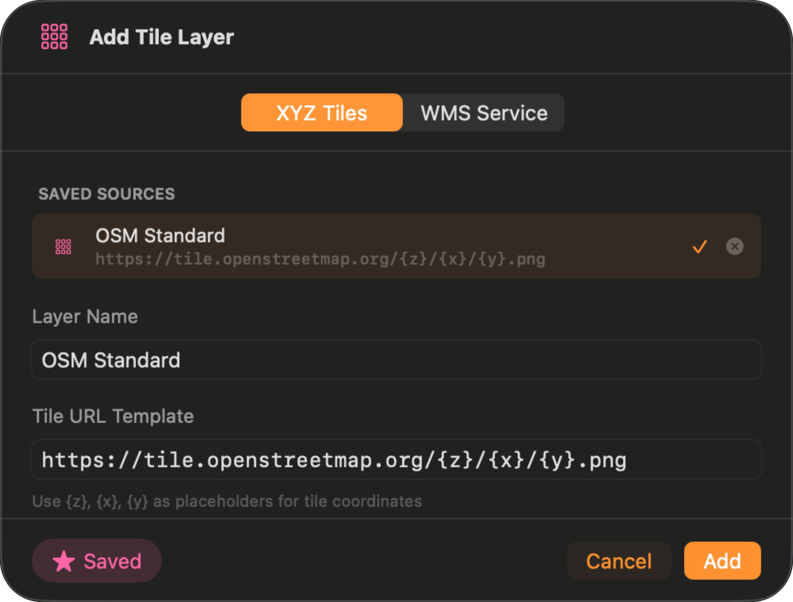
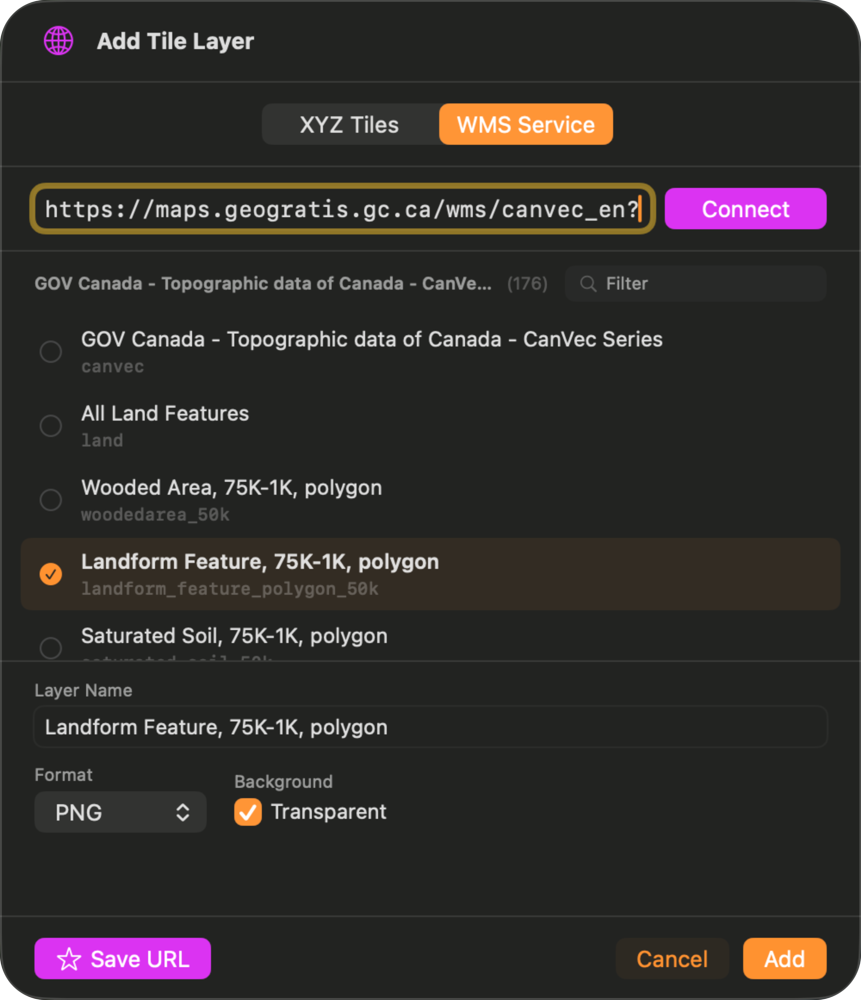

A tile layer is a map streamed from a server, such as government aerial imagery, a national topographic base map, or a geology or hydrology service. In TopoKit you can both add tile layers and download them for offline use.

**Tile layers do not come with the app.** Apart from [Apple's own base map](/manual/map-tools/#the-base-map-button), TopoKit ships with no base map catalogue and no preloaded imagery. You bring the source: paste a tile URL or a service address from a provider you choose, and it becomes a layer in your project. Many national and regional mapping agencies publish free services.

The server holds the map, and TopoKit fetches only the tiles it needs for the area you are looking at. TopoKit connects to two kinds of service:

- **XYZ tile servers**: one image file per tile, addressed by zoom level, column, and row. Any server that accepts URLs like `.../{z}/{x}/{y}.png` is an XYZ server.
- **WMS (Web Map Service)**: the [OGC standard](https://www.ogc.org/standards/wms/) used by most government agencies. Instead of a direct tile URL, WMS exposes a catalogue of named layers: you connect to one base URL, browse the available layers, and pick one, and TopoKit fetches it tile by tile like any other layer.

One WMS endpoint commonly carries dozens of layers — elevation, aerial imagery, hydrology, parcels — so a single address found once supplies several layers, where an XYZ address supplies exactly one. Both can be downloaded for offline use. See [Offline downloads](#offline-downloads).

## Finding a tile source

Because you supply the address, the first step is finding one. Many government agencies publish free map services: national mapping agencies, geological and hydrological surveys, and municipal or regional open-data portals.

Search the web for the data and the protocol together — `<region> orthophoto XYZ tiles` or `<region> topographic WMS` — and on an agency's portal, look for a heading such as Web Services, REST Services, or API.

The address tells you which tab to use. An XYZ address contains `{z}`, `{x}` and `{y}`. A WMS address contains `service=WMS` or `request=GetCapabilities`. A WFS, WMTS, WCS, or vector-tile address is neither, and will not work.

Test a new address in a browser before you rely on it: replace the placeholders with real numbers and open it. A picture means the service is public and ready to use. An error page or a login form means TopoKit cannot use it, since it sends no authentication.

**Make sure you follow the terms and conditions of any service before you add it to TopoKit.** Some services require attribution, and some restrict use to the publisher's own apps.

## Opening the Add Tile Layer sheet

Both kinds of layer are added from one sheet, with a tab for each.

:::mac
On Mac, open the **Layers** tab, click :ui[plus]{icon=plus}, and choose **Add Tiles (XYZ/WMS)**. The sheet is titled **Add Tile Layer**.
:::

:::ios
On iPhone, open the **Layers** tab, tap :ui[plus]{icon=plus}, and choose :ui[Add Tile Layer]{icon=add-tile-layer}.
:::

Select the **XYZ Tiles** tab to paste a tile URL, or the **WMS Service** tab to connect to a service and browse its layers.

## Adding an XYZ tile layer

1. **Layer Name.** Type the label the [layer tree](/manual/layer-tree/) will show. If you leave it blank, the layer is saved as "XYZ Layer".
2. **Tile URL Template.** Paste the provider's URL with its `{z}`, `{x}`, and `{y}` placeholders left intact: TopoKit fills them in as you pan and zoom. A `{s}` subdomain placeholder is also accepted. Copy the template exactly as the provider documents it — some services order it `{z}/{y}/{x}`.

   Example templates:
   - `https://tiles.example.com/{z}/{x}/{y}.png`
   - `https://tiles.example.com/basemap/{z}/{x}/{y}@2x.jpg`
   - `https://maps.example.gov/rest/services/Topo/MapServer/tile/{z}/{y}/{x}`
3. Tap **Add**.

The layer appears in the layer tree, visible by default — the sheet shows no preview, so the map itself is the first check. A layer whose address is wrong simply does not draw: no tiles appear, and whatever sits beneath it shows through.

### XYZ limits

- **API key placeholders.** There is no `{apiKey}` token: put the key directly in the URL, in whatever query-string pattern the provider documents.
- **Retina / @2x tiles.** There is no `{r}` placeholder. If the provider offers a separate high-DPI URL, use that URL directly.
- **Custom request headers.** You cannot add or change headers on a tile request: there is no field for an API key header, and the User-Agent is fixed. A provider that requires its key in a header will not work here; one that accepts the key in the URL will.
- **Tile size.** XYZ tiles are assumed to be 256 x 256.
- **TMS addresses.** Only XYZ is supported. If a provider offers both, take the XYZ URL.
- **Zoom range.** You don't set min or max zoom. TopoKit assumes the server publishes tiles up to z19 and scales the last tile up only past that ceiling; a zoom the server doesn't actually have comes back blank rather than upscaled. The first download sets the ceiling to the highest zoom it actually fetched, and later downloads can only lower it. See [Starting a download](#starting-a-download).

## Adding a WMS layer

Open the same **Add Tile Layer** sheet and select the **WMS Service** tab.

1. **WMS service URL.** Paste the base URL — either a bare endpoint (`https://maps.example.gov/ows/elevation`) or a full GetCapabilities URL, which TopoKit detects and uses as-is.
2. **Connect.** TopoKit issues a GetCapabilities request and parses the response. Both WMS 1.1.1 and 1.3.0 are supported, including nested layer hierarchies.
3. **Pick a layer.** The list shows both the human-readable title and the machine-readable layer name. An orange warning triangle flags layers that don't advertise Web Mercator (EPSG:3857, 900913, or 102100): expect blank or distorted tiles from those — see [WMS limits](#wms-limits). Use the search field to filter large catalogues.
4. **Layer Name.** Defaults to the layer's title. Override for a shorter label.
5. **Format.** PNG keeps transparency, JPEG is smaller for opaque imagery, and PNG 8-bit is a smaller PNG suited to flat-colour maps.
6. **Transparent.** Requests tiles with a transparent background so layers beneath show through. On by default; turn it off for opaque base imagery.
7. Tap **Add**.

### WMS limits

- **Web Mercator only.** TopoKit always requests EPSG:3857 (as `CRS=EPSG:3857` on WMS 1.3.0, `SRS=EPSG:3857` on 1.1.1). Layers that don't advertise it may return errors, blank tiles, or stretched imagery.
- **Tile size.** WMS tiles are requested at 512 x 512, online and in downloads.
- **Styles.** The server's default style is always used; there is no style control.
- **No attribute queries.** You cannot tap a WMS layer to ask the server what is underneath.
- **Zoom range.** Same as XYZ, with an assumed ceiling of z18. See [XYZ limits](#xyz-limits).

## Saving a source for reuse

Both tabs have a **Save URL** button, so you can add the same map to another project without pasting its address again.

- **XYZ.** Tap **Save URL** with the template in the field. Saved templates appear at the top of the XYZ tab, and can be renamed or deleted from their context menu.
- **WMS.** Tap **Save URL** after connecting to save the whole service. Each layer row then shows a star: favourite the layers you use and they are saved under that service, so tapping one adds it to the project in a single step, with no re-connect.

Saved sources live on the device rather than in the project, so every project you open on that device offers the same list.

## Managing and editing tile layers

Tile layers sit in the layer tree like any other row.

**A new tile layer arrives at the top of the tree and can hide your work.** Nothing is lost: drag it below your data and your points and lines reappear. See [the layer tree](/manual/layer-tree/) for draw order in full.

- **Visibility.** Toggle :ui[eye]{icon=eye} on any layer or parent folder. Hiding a folder hides every tile layer inside it.
- **Opacity.** Edit the layer to adjust opacity from 0 to 100%.

The edit sheet changes the name and opacity, nothing else; to change the URL, delete the layer and add it again — the copy button beside the URL in the edit sheet gives you the current template to correct.

## Offline downloads

Offline downloads pre-cache the tiles of an XYZ or WMS layer so that layer keeps rendering when you're off network.

Your own project data (points, lines, polygons, [imported rasters](/manual/raster-overlays/)) and any tile layer you have downloaded are all on the device, so they draw without a connection.

**Apple's base map cannot be downloaded**, and offline it shows only what the system happened to keep from earlier browsing. Download an XYZ or WMS layer over your work area before you leave, and follow that service's terms and conditions when you do.

### Starting a download

There are two ways in. The first is :ui[Download Data]{icon=download-data}. :mac[On Mac it is in the tool sidebar.] :ios[On iPhone it is in the Layers tab's :ui[plus]{icon=plus} menu, beside **Add Tile Layer**.] It opens a chooser sheet with two cards — pick **Map Tiles**. The other card, **Elevation Data**, fetches terrain instead — see [Elevation and DEMs](/manual/elevation/#downloading-tiles). Or skip the chooser: **Download for Offline** in a tile layer's context menu opens the same sheet with that layer already selected.

<video src="/media/tile-layers-tile-download.mp4" autoplay loop muted playsinline aria-label="Setting up a tile download on iPhone: picking the layer, drawing the region on the map, choosing the download mode and max zoom, and watching the tile count and storage estimate update"></video>

A download covers a rectangle you choose across a range of zoom levels, and a layer can hold as many of these downloads as you like. The sheet asks for four settings:

1. **Tile Layer.** Pre-selected when you launch from a specific layer; otherwise pick from the dropdown. The **Offline: …** layers created by earlier downloads are excluded — see [Using offline tiles](#using-offline-tiles).
2. **Region.** Define the rectangle with one of the options below.
   - :mac[**Map View** (Mac only): uses the current map viewport.]
   - **Draw**: closes the sheet so you can place two corners on the map. Tap the first corner, then the opposite corner, then tap **Done** on the [tool card](/manual/interface/#the-map). :ios[On iPhone, each corner tap is confirmed with haptics.] The rectangle stays on the map while you finish configuring, and a reset button lets you redraw it. If the selected layer is hidden, tapping **Draw** turns its visibility back on so you can see what you are drawing over, and leaves it on afterwards.
   - **Coordinates**: takes NW and SE corners typed into the [coordinate editor](/manual/points-lines-polygons/#coordinate-entry-formats). NW must be north and west of SE, or the input is flagged invalid.
3. **Download Mode.**
   - **All zoom levels** (default): downloads from zoom 0 up to your chosen max. The download is larger: every zoom level below the max is fetched rather than rebuilt.
   - **Max resolution only**: downloads just the max zoom, then builds the lower zoom levels itself from the tiles it already has, clipped to your rectangle. The network download is smaller, with a brief processing phase at the end where the progress bar reads "Building: {layer name}".
4. **Max Zoom Level (1–20).** Each extra level quadruples the tile count. The download also records the highest zoom it actually fetches as the layer's online ceiling — past it you see overzoom rather than fresh tiles, and later downloads can only lower it — so pick the highest zoom the server actually publishes, not the lowest that covers your work. Many servers publish nothing above z17.

The sheet's **Tiles** and **Storage** estimates update as you adjust inputs. The tile count is exact; the storage estimate is a rough average — see [the FAQ](#faq) for real-world sizes. A warning appears when the download is large; it is advisory and never blocks the download.

### During a download

Tap **Download** and:

- A progress bar appears on the map, showing completed / total, a red failed count as soon as any tile fails, percentage, and a cancel button. :ios[On iPhone the same bar also appears in the layer tree.] Multiple downloads run in parallel, each with its own bar.
- Tiles already on disk are skipped, so resuming or retrying only fetches what's missing.
- A tile that fails temporarily (a dropped connection, a server hiccup) is tried up to three times with a growing delay. A tile the server answers with any 4xx — a missing tile's 404, a rate limiter's 429 — is not retried.

To cancel a download in progress, tap the × on its progress bar and confirm. The download stops, its region is removed, and its partial tiles are discarded unless another completed region shares them.

To retry a download that finished with failures, use **Retry Failed** in the **Download Complete** alert; a download that failed outright offers **Retry** in its **Download Failed** alert.

### Using offline tiles

When a download completes, TopoKit creates a sibling **"Offline: {layer name}"** layer in the tree. Each completed region gets its own such layer holding just that region: a second download off the same source becomes **"Offline: {layer name} (2)"**, a third **"(3)"**; regions never merge. An offline layer reads only the tiles on disk for its region, stays visible without a connection, and toggles independently of the source layer, so you can switch between online high-detail and offline-only without re-downloading. It also keeps its own opacity: it starts at 100% however the source layer is set, and changing one never changes the other. The source layer's own settings are untouched. Zoom in past the downloaded max and the offline layer scales up its sharpest tile (blurry but readable).

### Managing offline tiles

Downloaded tiles are never purged by the system to reclaim space, and they count toward [TopoKit's storage footprint](/manual/ui-settings-styling/#storage-and-cache). All of a layer's tiles share one store, so overlapping downloads keep only one copy of the tiles they have in common. They also stay on the device that fetched them — see [Offline tiles and your other devices](#offline-tiles-and-your-other-devices).

To remove downloaded tiles, choose **Remove Offline Tiles** from the tile layer's context menu. It deletes all of that layer's tiles at once. Removal is all-or-nothing per layer: to keep a smaller area, remove the tiles and re-download just the part you want.

### Interrupted downloads

If the app crashes or is force-quit during a download, nothing already on disk is lost — start the same download again and it fetches only what is missing.

### Offline tiles and your other devices

**Downloaded tiles never sync.** They stay on the device that fetched them, on both platforms, even when the project itself is stored in [iCloud Drive](/manual/projects-and-files/#icloud-sync). Tile caches run to gigabytes and belong to the device, not the project.

The project does carry the record of each download: its rectangle and zoom range. Open the same project on another device and the **"Offline: {layer name}"** layer is there, with an **Offline tiles available** banner at the top of the layer tree offering **Download** (or **Later** to dismiss it); the same action appears in the layer's context menu as **Download for This Device**. Either action re-fetches those tiles locally using the saved rectangle and zoom range, so you never have to redraw the region. Each device keeps its own copy, and removing tiles on one device leaves the others untouched.

Download tiles on whichever device is going into the field.

## FAQ

**Why did my download stop before finishing?**

- **Persistent 4xx errors.** Check the URL, the server status, and whether your zoom range exceeds what the server actually publishes. If every tile fails, the **Download Failed** alert offers **Retry**.
- **Rate limiting.** A server that throttles bulk requests fails tiles outright or slows the download to a crawl. Download a smaller area at a time.
- **A dropped network.** The session waits for connectivity, but on a flaky connection individual tile retries can still run out. Reconnect and re-run the download.

**Why do tiles show as grey or blurry after I go offline?**

- **The built-in base map.** It cannot be downloaded, so offline it shows only whatever the system still had cached. See [Offline downloads](#offline-downloads).
- **Zoom past the downloaded max.** The offline layer is scaling up its sharpest tile.
- **Pan outside the downloaded rectangle.** There are no tiles on disk there.

Before leaving coverage, pick a slightly larger rectangle and download at the server's maximum zoom — see [Starting a download](#starting-a-download).

**How much disk space will an area take?**

There's no simple formula, because tile size varies wildly by terrain. Rules of thumb: PNG averages ~15 KB and JPEG ~8 KB, with real tiles running from ~1 KB over ocean to 50+ KB over dense urban; the sheet's estimate is usually within a factor of 2. As a rough guide, 1000 km² is about 1,600 tiles (~24 MB) at zoom 15, ~25,000 tiles (~375 MB) at zoom 17, and ~100,000 tiles (~1.5 GB) at zoom 18.

**Can I use a commercial tile provider?**

TopoKit renders tiles from any XYZ-compatible URL, with an API key in the URL if the service needs one. Check that service's terms first: many commercial providers allow their tiles only in their own apps, and restrict caching and bulk downloads. Following the terms of the services you add is up to you.

**Why does my WMS layer connect but not render?**

- **No Web Mercator support.** See [WMS limits](#wms-limits) — a warning triangle in the capabilities list flags this in advance.
- **An error image instead of tiles.** Some services answer with a "layer not available" image, which TopoKit draws like any tile: the layer renders, showing the server's message instead of map data, and no error is raised.
- **Authentication required.** TopoKit sends no authentication — see [Finding a tile source](#finding-a-tile-source).
- **Wrong layer name.** This is rare, but possible with deeply nested hierarchies; try another candidate from the list.
