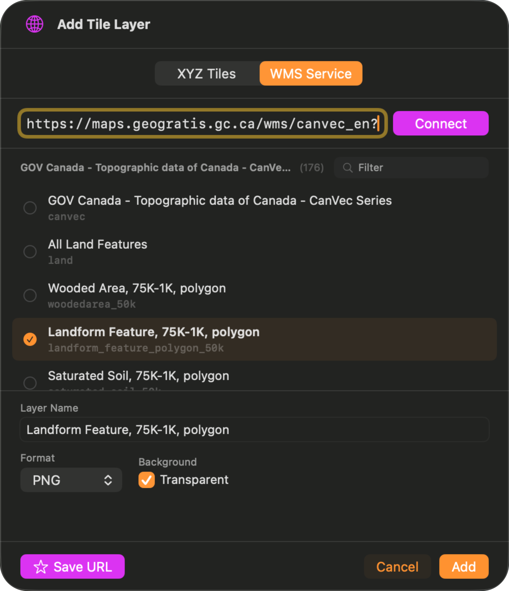

A tile layer is a map streamed from a server, such as government aerial imagery, a national topographic map, or a geology service. TopoKit fetches only the tiles for the area on screen.

Apart from [Apple Maps](/manual/basemaps/#the-apple-maps-switch) and the basemaps it builds, TopoKit ships no tile sources: you paste the address of a service you choose. For a topographic map without a source of your own, :ui[Basemaps] in the tool sidebar [builds one](/manual/basemaps/#building-a-basemap).

## Finding a tile source

National mapping agencies, geological surveys and regional open-data portals publish free map services, usually under Web Services, REST Services or API.

The address decides which tab it goes in. An XYZ address contains `{z}`, `{x}` and `{y}`, one image per tile addressed by zoom, column and row. A WMS address contains `service=WMS` or `request=GetCapabilities`, one address behind a catalogue of named layers. A WFS, WMTS, WCS or vector-tile address is neither, and does not work.

Test an address in a browser first, with real numbers in place of the placeholders. An error page or a login form means TopoKit cannot use it, because TopoKit sends no authentication. Follow each service's terms: some require attribution, and some forbid bulk downloading.

## Adding a tile layer

:::mac
On Mac, choose **Add Tile Layer…** from :ui[Add Data]{icon=plus} in the [tool sidebar](/manual/interface/#the-tool-sidebar), from :ui[plus]{icon=plus} in the **Layers** tab, or from **Layer → Add Tile Layer…** in the menu bar.
:::

:::ios
On iPhone, tap :ui[Add Data]{icon=plus} in the [tool sidebar](/manual/interface/#the-tool-sidebar) or :ui[plus]{icon=plus} in the **Layers** tab, and choose **Add Tile Layer…**. The sheet opens as a page in the **Layers** tab, and a pick from the sidebar brings that tab up.
:::

Adding a tile layer, editing one and downloading tiles are part of the full app, though tile layers and downloaded tiles already in a project keep drawing without it; see [Your TopoKit](/manual/your-topokit/).

The new layer goes to the top of the **Layers** tab. The sheet shows no preview and accepts any text as a template, so a wrong address is added and draws nothing. At the top of the tree, the layer hides the points below it everywhere; drag it below your data ([Draw order](/manual/layer-tree/#draw-order)).

### Adding an XYZ tile layer

1. Type a **Layer Name**. Left blank, the layer is named "XYZ Layer".
2. Paste the provider's address into **Tile URL Template** with its placeholders intact, in the order the provider documents. Some services use `{z}/{y}/{x}`, as in `https://maps.example.gov/rest/services/Topo/MapServer/tile/{z}/{y}/{x}`.
3. Tap **Add**.

The template accepts two more placeholders. `{s}` is always filled with `a`; for a server whose subdomains have other names, type one of them in place of `{s}`. For a TMS server, which counts rows from the south, write `{-y}` in place of `{y}`; with `{y}`, its tiles come back from the wrong rows, with north and south swapped.

- **API keys**: put the key in the address as the provider documents it. TopoKit has no way to add a header, so a provider that wants its key in a header does not work.
- **Tile size**: 256 × 256 pixels.
- **Zoom ceiling**: TopoKit assumes the server publishes up to z19 and scales up the last tile beyond that. A zoom below the ceiling that the server lacks comes back blank. A download that gets no tiles at its max zoom lowers the ceiling to the highest zoom that did arrive, and a later download the server serves in full to a deeper zoom raises it again.

### Adding a WMS layer

1. Select **WMS Service** and paste the service address. A bare endpoint gets the GetCapabilities request added; an address that already carries `SERVICE` and `REQUEST` is used as is.
2. Tap **Connect**. TopoKit reads WMS 1.1.1 and 1.3.0 capabilities, nested layers included. A failure shows its reason in red under the field; `WMS server error: HTTP 401` or `HTTP 403` means the server wants a login.
3. Pick a layer. Each row shows the title and the machine name, and **Filter** narrows a long catalogue. An orange triangle marks a layer that does not advertise Web Mercator.
4. Choose a **Format**. PNG keeps transparency, JPEG is smaller for opaque imagery, and PNG 8-bit is a smaller PNG for flat-colour maps.
5. Leave **Transparent** on for a map that should let the layers beneath, and Apple Maps' place names, show through. Turn it off for opaque imagery, which then hides Apple's names wherever it draws.
6. Tap **Add**.

- **Projection**: TopoKit always requests EPSG:3857.
- **Tile size**: 512 × 512 pixels, on the map and in downloads.
- **Style**: always the server's default.
- **Zoom ceiling**: as for XYZ, starting at z18.

### Saving a source for reuse

- **XYZ**: **Save URL** saves the name and template at the top of the **XYZ Tiles** tab. Tapping a saved template fills in the form without adding the layer.
- **WMS**: **Save URL** after **Connect** saves the service, and each layer row then shows a star. A starred layer is saved with the **Format** and **Transparent** settings the sheet had at the time, and tapping it under its saved service adds it in one step, without connecting. **Browse more layers...** under the starred layers, or **Connect & Browse** in the service's context menu, connects again and lists the whole catalogue.

Saved sources are kept on the device, not in the project, so every project on that device offers them and other devices do not. Rename or remove one from its context menu.

## Managing tile layers

**Edit** in a tile layer's context menu opens its editor. :mac[On Mac, **Layer → Edit Layer…** (Cmd-I) opens it too.] The editor changes the name and the opacity, nothing else, and the opacity changes on the map as you drag. :ios[On iPhone, tap **Save** to keep a new name; leaving without saving keeps the opacity but not the name.] :mac[On Mac the editor is a popover that keeps the new name when it closes.]

To change the address, delete the layer and add it again. Tap the address under **Source URL** to copy it first; for a WMS layer, the **Layer** row below it copies the machine name to find again with **Filter**.

A tile layer draws over Apple Maps, place names included, so Apple's names show only through the transparent parts of its tiles or through a layer below 100% opacity.

## Offline downloads

A download saves an XYZ or WMS layer's tiles, over a rectangle and a range of zooms, to this device, so the layer draws without a connection. A layer can hold any number of downloads.

### Starting a download

**Download Map Tiles…** in the :ui[Add Data]{icon=plus} menu or the **Layers** tab's :ui[plus]{icon=plus} menu opens the download sheet. :mac[On Mac it is also in the **Layer** menu.] The row below it, **Download Elevation…**, fetches terrain instead; see [Elevation](/manual/elevation/#downloading-tiles). **Download for Offline** in a tile layer's context menu opens the same sheet with that layer selected. :mac[On Mac, **Layer → Download for Offline…** does the same for the selected layer.]

1. **Tile Layer**: choose the layer. **Offline: …** layers and built basemaps are not offered.
2. **Region**: set the rectangle.
   - :mac[**Map View**: on Mac, the current map view.]
   - **Draw**: the sheet closes. Tap two opposite corners on the map, then **Done** on the tool card, and the sheet returns; the ✕ on the tool card abandons the download without it. A third tap places nothing; before **Done**, the reset arrow on the tool card clears the corners. To redraw after **Done**, tap **Draw** again. Draw turns a hidden layer on and leaves it on.
   - **Coordinates**: type a **Northwest Corner** and a **Southeast Corner**, in any [coordinate format](/manual/points-lines-polygons/#coordinate-entry-formats). The northwest corner must be north and west of the southeast one.
3. **Download Mode**: **All zoom levels** fetches every zoom from 0 to the max. **Max resolution only** fetches only the max zoom and builds the lower zooms from it on the device, clipped to the rectangle, so it downloads less; the progress bar reads "Building: {layer name}" while it does.
4. **Max Zoom Level**: from 1 to 20, starting at z16. Each level up quadruples the tile count.
5. Tap **Download**. The sheet closes and the download starts.

The **Tiles** estimate is exact. The **Storage** estimate counts every tile at 15 KB whatever the format, so it runs high for JPEG imagery. A warning appears once the estimate passes 500 MB; it never blocks the download.

### While it downloads

Each download has its own progress bar with the layer name, a tile count, a red count of failed tiles once any fail, and a × to cancel. Several downloads run at once. :ios[On iPhone the bars are drawn just above the bottom sheet, so they stay in view whichever tab is open.] :mac[On Mac they are at the bottom of the map.]

- **Cancel**: × then **Cancel Download** stops the download and drops its rectangle. If the layer has no finished download, its partial tiles are deleted; if it has one, they stay and a later download reuses them.
- **Retries**: a tile that fails on a dropped connection or a server error is tried up to three times. A tile the server refuses with a 4xx answer, such as 404 or 429, is not retried.
- **Finishing**: **Download Complete** reports the count and, when tiles failed, offers **Retry Failed** to fetch them. A download where every tile failed ends in **Download Failed**, with **Retry**.
- **Stopping**: downloads run only while their project is open. Closing it, opening another project, a crash or a force-quit stops them. Tiles already on disk are kept, and the same download started again fetches only what is missing.

### Downloads over cellular data

:::ios
On iPhone, a tile download checks before it uses cellular data or a personal hotspot, following **Settings → Storage & iCloud → Large Downloads** ([Storage & iCloud](/manual/settings/#storage--icloud)).

**Always Ask**, the default, asks **Download Using Cellular Data?** once, however many downloads are waiting, and the answer holds until the iPhone is next on Wi-Fi: **Download** lets downloads use cellular data until then, and **Wait for Wi-Fi** holds them. **Always Allow** also changes the setting, so TopoKit stops asking. **Wi-Fi Only** holds every download without asking.

The check repeats as a download runs, so one started on Wi-Fi does not carry on over cellular data unasked. A held download's bar reads "{layer name}: Waiting for Wi-Fi…", and the download carries on by itself once the iPhone is on Wi-Fi. The same setting covers [elevation data](/manual/elevation/#downloading-tiles) and a basemap's map data. Browsing the map and iCloud sync are not affected.
:::

:::mac
The Mac has no cellular setting and downloads over any connection, a personal hotspot included.
:::

### Using offline tiles

A finished download adds an **Offline: {layer name}** layer at the top of the source layer's folder. The next is **Offline: {layer name} (2)**, and so on; downloads never merge. Each reads only the downloaded tiles inside its own rectangle, shows and hides separately from its source, and starts at 100% opacity. Past the downloaded max zoom it scales up its sharpest tile. **Zoom to** on either layer fits the map to the downloaded rectangles.

Downloaded tiles never sync. The project carries each download's rectangle and zoom range, so on another device the **Offline: …** layer is there without tiles. The **Layers** tab offers them in an **Offline tiles available** banner, and the layer's context menu has **Download for This Device**; either fetches the same rectangle and zooms again on that device, every zoom from the server, so a **Max resolution only** download is larger there than on the device that built it. The menu item stays until every rectangle has its tiles on this device. Built basemaps follow their own rule ([Other projects and other devices](/manual/basemaps/#other-projects-and-other-devices)).

### Removing downloaded tiles

The system never purges downloaded tiles. A layer's downloads share one store, so overlapping downloads keep one copy of the tiles they share, and the total shows in **Settings → Storage & iCloud → Downloaded Map Tiles**.

| Action | What it removes | What stays |
|---|---|---|
| **Remove Offline Tiles** in the source layer's context menu | Every downloaded tile of that layer, after **Remove Offline Tiles?** | The layer, which streams from the server again |
| **Clear Downloaded Map Tiles** in [Storage & iCloud](/manual/settings/#storage--icloud) | Downloaded tiles of every layer in every project, deleted layers included, plus the tiles of [basemaps built on this device](/manual/basemaps/#storage) | Every layer, offline layers and basemaps included |
| Deleting the layer | The layer, and any download it is running | Its downloaded tiles, which its **Offline: …** layers keep drawing |

**Remove Offline Tiles** appears once the layer has a finished download, never on an **Offline: …** layer, and removes all of the layer's downloads at once; to keep a smaller area, remove them and download that area again. :mac[On Mac it is also **Layer → Remove Offline Tiles…**.] Choose **Remove Offline Tiles** before deleting a layer you no longer need offline.

A tile layer copied with **Copy** and **Paste**, or with **Duplicate**, comes without its downloaded tiles: the copy streams from the server, even when it is copied from an **Offline: …** layer ([Copying, pasting and duplicating](/manual/layer-tree/#copying-pasting-and-duplicating)).

## FAQ

**Why did my download stop, or finish with failed tiles?**
Tiles fail past the zoom the server publishes, and a server that throttles bulk requests refuses some; download a smaller area at a time. :ios[On iPhone, a bar that reads Waiting for Wi-Fi is held by [Large Downloads](#downloads-over-cellular-data).]

**Why is a downloaded layer grey or blurry with no connection?**
Outside the rectangle there are no tiles. Past the downloaded max zoom the layer scales up its sharpest tile. Draw the rectangle slightly larger than the work area.

**Why does my WMS layer connect but draw nothing?**
A spinner on its row in the **Layers** tab means tiles are still loading. A layer marked with the orange triangle does not advertise Web Mercator. A server that answers with an error picture has it drawn like any other tile. A server that wants a login gets none from TopoKit.

**Why does Download Map Tiles… say "Add a tile layer first."?**
It downloads only XYZ and WMS layers added to the project. Apple Maps cannot be downloaded, and a built basemap is already on the device.
