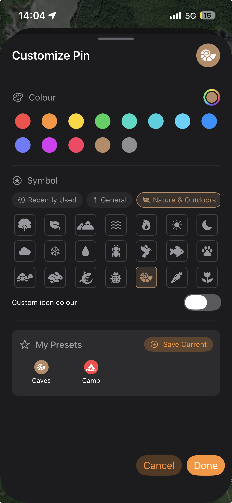

[The interface](/manual/interface/) covers the layout of the app. This is the reference: every Settings page, the Mac right-click menu, the search bar and its coordinate formats, and the styling system for pins, lines and polygons.

## Settings

Settings opens as a **list of nine categories**, not one long page. macOS shows seven — **GPS & Recording** and **Toolbar** are iPhone-only. Open it from the **Settings** tab on iPhone, or on Mac from the **Settings** tab in the panel or **TopoKit → Settings** (`Cmd-,`).

| Category | What it contains | Platform |
| --- | --- | --- |
| **Appearance & Controls** | Theme, UI Style, panel side, compass and rotation | |
| **Toolbar** | Sidebar edge, icon size, swipe-to-dismiss, haptics | iPhone |
| **Units & Coordinates** | Metric/imperial, default measurement units, coordinate format | |
| **GPS & Recording** | Recording profile, auto-pause, track line style | iPhone |
| **Data Defaults** | Reprojection quality, default and imported feature styles, clustering | |
| **Storage & Cache** | Cache sizes and clear buttons, photo resolution | |
| **iCloud** | Sync status, storage use, keep-offline | |
| **Developer & Diagnostics** | Debug mode, logs, raster tracing | |
| **About TopoKit** | Version, What's New, licences, feedback | |

### Appearance and controls

- **Theme**: **System**, **Light** or **Dark** for TopoKit's own panels and controls:v111[, and for the map canvas under **No Map**]. It does not affect exports.
- **UI Style**: **Solid** (default, opaque, most readable in bright sun), **Blur** (a frosted translucent panel that blurs the map behind it), or **Glass** (Apple's translucent Liquid Glass material, which also refracts and shifts as you move). Applies to the compass, zoom buttons, tool sidebar, scale bar and the Mac top bar.
- **Solid Panel Background** (appears only when UI Style is Glass or Blur): keeps the Mac panel, and the iPhone bottom sheet, opaque while the smaller controls stay translucent.
- :mac[**Panel Position**: which side of the window the panel sits on. It floats over the map, which stays full-width underneath rather than reflowing.]
- **Lock North Up**: disables the rotate gesture.
- **Always Show Compass**: show the compass even when the map is already north-up.

:::ios
### Toolbar

- **Show Toolbar**: whether the tool sidebar is drawn. It is the only route to the tools and to the base map button, so turning it off puts both out of reach — and it hides the four settings below until you turn it back on.
- **Position**: which edge the sidebar sits on. It floats over the map, which stays full-screen underneath.
- **Icon Size**: 36, 44 or 52 points per button. The sidebar sizes itself to fit, so Small gives back the most map and Large makes the six tools and the base map button easiest to hit with gloves on.
- **Swipe to Dismiss**: whether a horizontal swipe toward the edge collapses the sidebar.
- **Haptic Feedback**: light taps to confirm an action. It covers the whole app, not just the sidebar.
:::

### Units and coordinates

- **Units**: Metric or Imperial. On first launch this follows the device locale. **Changing Units resets the default distance and area units below to values appropriate to the new system.**
- **Measurement Defaults**: the distance unit, area unit and bearing type a measurement tool opens with. You can still override the units on an individual measurement. Magnetic North needs the iPhone's magnetometer, so Mac offers only True North and Back Bearing.
- **Coordinate Format**: DD, DMS, DDM, or UTM. Controls how coordinates are displayed throughout the app (feature info, point editor, status, exports that use formatted coordinates, right-click menu on macOS). It does not change how data is stored: all coordinates are stored as WGS84 lat/lon regardless of the display preference.

:::ios
### GPS and recording

- **Recording Profile**: Strict filter, Balanced (default), Permissive, or Record All Fixes. Each sets a distance filter, an accuracy threshold and jump filtering; [GPS and track recording](/manual/gps-and-track-recording/) has the numbers.
- **Auto-Pause When Stationary**: pauses recording when you stop moving. This saves battery and prevents GPS drift from adding stray points to the track while you are stationary.
- **Track Line Style**: opens the line customization sheet for recorded tracks (width, colour, pattern, opacity).
- **Randomize Track Colour**: when on, each new track gets a random colour instead of the track style's colour. The style's other properties (width, pattern, opacity) still apply.
:::

### Data defaults

- **Raster Reprojection Quality**: the pixel cap on the longest side of a reprojected copy — 2048, 4096, 8192, or none. It only ever caps, so a source already smaller than the setting is untouched. See [Reprojection quality](/manual/raster-overlays/#reprojection-quality).
- **Default Point / Line / Polygon Style**: the style applied to features you draw when no folder override applies. Drawn lines and polygons start from the orange dashed "measuring" look; change it here if you want drawn features saved in a different style.
- **Default Vertex Style**: the dots drawn while you create and measure. Unlike the other defaults this is not saved into features — it is read fresh every time you draw, so changing it changes what you see immediately.
- **Imported Line Style / Imported Polygon Style**: the style applied to features brought in from files (GPX, KML, GeoJSON, GeoPackage). These are separate settings from the drawing defaults, and TopoKit seeds them once from your drawing styles the first launch after you have customized those. From then on they are fixed: imports keep that look however your drawing style changes later.
- **Default Route Style**: the style a route starts with when you save it from the Directions tool. You can change it in the save sheet before committing, and it is written into the route at that point, so changing this setting later leaves saved routes alone. Unlike the other drawing defaults it is not linked to the line style.
- **Point Clustering**: when multiple points sit near each other at low zoom, they merge into a numbered cluster. Off if you want to see every pin regardless.

### Storage and cache

- **Total App Cache**: the combined size of the three caches below. Photos are not counted in it.
  - **Reprojection Cache**: cached reprojected raster images. Clearing costs you a re-reprojection wait the next time you open a large raster.
  - **Offline Tile Downloads**: downloaded XYZ/WMS tiles for offline use.
  - **Elevation Data**: Copernicus GLO-30 DEM tiles (25–40 MB each). Downloaded on demand. Can be managed individually via **Manage Tiles** or cleared all at once.
- **Photo Resolution**: the longest side a photo is saved at — 3024 px at High, 2048 px unless you change it, 1024 px at Low, or the original. It applies when the photo is taken, so photos already in the project keep the size they were saved at. Photos never count toward the cache total.

### iCloud

The page reports whether iCloud Drive is available, how much iCloud space projects and rasters use, and the path to the projects folder. With iCloud Drive off it shows a hint to turn it on in System Settings.

- **Keep All Projects Offline**: ensures every project has a local copy, so they're usable without internet. When toggled off, projects can be evicted by iOS to save space and will re-download when opened.

### Developer and diagnostics

- **Debug Mode**: raises a popup the moment the app hits an error, and records debug and info entries alongside the errors and warnings it keeps anyway. A cascade of errors collapses into a single popup with a "+N more" count rather than one popup each.
- **Diagnostic Logs**: errors and warnings are recorded on your device even when Debug Mode is off. **View Logs** opens the in-app log viewer; **Send Logs to Developer** packages them into a report.
- **Raster Trace Logging**: adds every step of raster import and reprojection to the log. It costs performance on large rasters, so turn it on for the run you want captured and off again afterwards.

### About TopoKit

- **What's New**: the release notes for every version, newest first. An orange dot marks notes you have not read, on this row and on the **About TopoKit** row in the Settings list.
The rest of the page is reference and links: the installed version number, third-party open-source licences, the App Store review page, the privacy policy and terms of use, an email to the developer, and **Replay Introduction**, which re-runs the onboarding intro.

## Search and the map menu

:::mac
### The Mac right-click menu

Right-click anywhere on the macOS map:

- **Drop Pin Here** saves a point at that spot, named Dropped Pin.
- **Directions** opens routing with that spot as the destination and your position as the start.
- **Measure Distance From Here** starts the line tool with its first vertex already placed; **Measure Area From Here** does the same with the polygon tool.
- **Copy Coordinates** copies the spot in your chosen coordinate format. **Copy as Decimal Degrees**, **Copy Latitude** and **Copy Longitude** ignore that setting and always copy decimal degrees.

The first four need a project open; the copy items work without one. Each copy item shows the value it will put on the clipboard, so you can read a coordinate straight off the menu.
:::

### Search bar

:mac[On Mac, the search bar is in the top bar above the map.] :ios[On iPhone, the search bar is at the top of the **Layers** tab.] Wherever you reach it, it searches three sources simultaneously and displays the hits grouped by source:

1. **Coordinates**: anything you type that parses as a coordinate gets a "Go to coordinate" result at the top of the dropdown (see [Coordinate formats](#coordinate-formats)).
2. **Layers**: items in your project's layer tree. This searches names of folders, features, rasters, and tile layers; for point features it also matches coordinates typed as text; for all vector features it matches values in the feature's properties (tags, labels, imported attributes). You can also type a category name (`points`, `lines`, `polygons`, `rasters`, `tiles`, `folders`, `vectors`) to list everything of that type.
3. **Places**: Apple's geocoder (addresses, businesses, landmarks). Suggestions appear as you type, with a small spinner while Apple resolves them; very short queries may return few or no matches until you type more.

Selecting a result zooms to it and opens its info popover. **Folders** and **tile layers** are the exceptions — a folder has no single location and a tile layer covers the world, so the map stays put and nothing opens.

#### Coordinate formats

Type a coordinate directly into the search bar in any of the four formats below: it appears as the top result, labelled "Go to coordinate" with the parsed value underneath. There is no separate "Go to coordinate" dialog to open anywhere else in the app.

| Format | Type this | Notes |
| --- | --- | --- |
| **DD** decimal degrees | `49.976361, -124.149780` | Separator can be a comma, a semicolon, or a space. `°` is ignored. Hemisphere letters optional, at either end (`49.976361N 124.149780W`). Label the first value E or W and TopoKit takes it as longitude-first and swaps. |
| **DMS** degrees minutes seconds | `49°58'35"N 124°08'59"W` | Hemisphere **required** on both halves. Degree and minute markers **required**: `°` or lowercase `d` for degrees, `'` `′` or lowercase `m` for minutes — uppercase `D`/`M`/`S` are not recognized. The seconds mark (`"`, `″` or lowercase `s`) is optional; seconds may have decimals. Bare `48 51 24 2 21 07` will not parse. |
| **DDM** degrees decimal minutes | `49°58.5817'N 124°08.9868'W` | Marine charts. Degree marker (`°` or lowercase `d`) and hemisphere required; the minute marker after the minutes (`'`, `′` or lowercase `m`) is optional. |
| **UTM** | `10U 417559 5536636` | Zones 1–60. Easting must be six digits (100 000–999 999), northing 0–10 000 000. A trailing `E`/`N` is tolerated. The zone letter sets the hemisphere: letters before `N` are southern. A UTM result is shown with its zone label, for example "UTM 10U". |

Type something that looks like a coordinate but will not parse, and the dropdown says "Invalid coordinate format" with an example to copy, above whatever layer and place hits the text matched. Text that does not look like a coordinate is simply searched as text.

## Styling and presets

Every feature has its own style, saved with it. Where that style comes from when you have not set one — the app default, or a folder you applied symbology from — is covered in [Points, lines, polygons and circles](/manual/points-lines-polygons/#point-style-and-folder-defaults). The starting values for every default live in [Settings → Data Defaults](#data-defaults).

### Customizing pins, lines and polygons

**Pins** have a marker tint colour, an optional glyph, and an optional glyph colour that is white until you set one. Colour offers thirteen swatches plus a full picker. The plain map pin in the **General** category is the no-glyph choice: pick it and the marker goes back to a plain pin. The glyph colour control only appears once a glyph is set, so a pin with no glyph stays white whatever colour you choose. Your eight most recent glyphs collect under **Recently Used**, which the picker opens to — until you have picked one, that category is hidden and the picker opens on **General**.

**Lines** have a stroke colour, a width from 1.0 to 10.0 pt, a pattern (Solid, Dashed, or Dotted, which uses round caps), and an opacity from 0.1 to 1.0.

**Polygons** style stroke and fill separately: stroke gets colour, width, pattern and opacity, and fill gets colour and opacity. Both polygon opacities run from 0.0, so a fill of zero leaves an outline-only polygon and a stroke of zero leaves a fill with no edge — neither of which a line can do. Fill opacity starts low so the map stays readable: **0.15** for polygons you draw, **0.25** for imported ones and anything with no style of its own. The first swatch in the stroke palette matches the stroke to the fill colour.

### Folder styling

Styling a folder is how you restyle many features at once: the style is applied to everything already inside it, in one pass. It is not a live default — anything you add afterwards starts from the app default, and there is nothing to reset.

### User style presets

None of the three sheets ship built-in presets: the **My Presets** row starts empty and fills only with styles you save yourself, from inside the sheet, and you delete them there from a preset's context menu. Style presets cannot be renamed — save a new one and delete the old.

There are also **tile source presets** (named XYZ URL templates) and **WMS favourites**, which are hierarchical: you save a service, then favourite individual layers inside it. Unlike style presets these can be renamed, with **Edit Name** on a saved XYZ source and **Rename** on a saved WMS service or layer.

All of them live in the device's local preferences rather than the project file, so they persist across projects and launches. **They do not sync between devices.** A project opened on another device still renders correctly, because the styles themselves are saved in the project — you just will not see that device's preset list until you build it there.

## FAQ

**Why do I see fewer settings categories on macOS?**

The **GPS & Recording** and **Toolbar** categories are iPhone-only. Track recording uses the iPhone's location services and, for bearing, its magnetometer, neither of which a Mac has. The Toolbar category configures the iPhone's edge-of-screen sidebar, which the Mac sidebar replaces.

**What does changing units do to existing features?**

Nothing. Distances and areas are computed from the coordinates every time you look at them, never stored, so the setting only changes how they are displayed and measured.

**Why did my search find the wrong place?**

Place search uses Apple's geocoder, which is biased toward the region Apple thinks you are in and toward populated places. Adding the country or city disambiguates (`Springfield, Oregon`). A recognized coordinate is always the top result, so type the coordinate rather than the name when you have one.

**Can I copy a coordinate off the map?**

:mac[On Mac, right-click the map for several copy formats.] On iPhone, tap a pin or a search result to open its info panel, then tap the coordinate line to copy it in your chosen format.

**Can I change the map type per-project?**

No, it is a global preference. See [The base map button](/manual/map-tools/#the-base-map-button). Add a tile layer or raster if you need one project to look different from another.

**Why didn't my customization apply?**

Check whether a folder's applied symbology or the app default is the source of the style you are seeing. See [Point style and folder defaults](/manual/points-lines-polygons/#point-style-and-folder-defaults).

**Can I make a feature use the default style again?**

Not directly — there is no reset button. A feature keeps the style it was saved with, so either set the values back by hand in its customization sheet, or delete it and re-create it, which picks up the current default.

**If I change the default pin style, do existing pins change?**

No. Defaults apply only to features you create after the change. Existing features keep whatever style they were saved with, unless you edit them individually.
