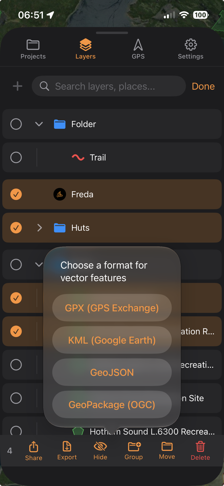

TopoKit reads **GPX**, **KML**, **KMZ**, **GeoJSON**, and **GeoPackage**, and writes all of them except KMZ.

Everything in a TopoKit project is stored in **WGS84** (EPSG:4326, decimal degrees). Imports are converted on the way in and every export is written back out in WGS84.

## Importing

:::mac
On Mac, choose :ui[Add Vector]{icon=import-vector} from the :ui[plus]{icon=plus} menu in the Layers tab, click :ui[Import Vector]{icon=import-vector} in the tool sidebar, or drag files from Finder onto the window. Double-clicking a supported file in Finder also opens it.
:::

:::ios
On iPhone, tap :ui[plus]{icon=plus} in the **Layers** tab and choose :ui[Add Vector]{icon=import-vector}, then pick a file from the Files picker (iCloud Drive, On My iPhone, or any file provider). A supported attachment also opens from Mail, Messages, or Safari with **Open With → TopoKit**.
:::

Parsing runs in the background, so you can pan the map and work with other layers while a large file loads. Imported features are added to the layer tree as one folder named after the file, with every imported feature as a direct child row of that folder.

If a file cannot be parsed at all, an alert explains why. Anything short of that is silent — skipped features and empty files are only logged — so check the imported feature count against what you expected.

GPX, KML, and GeoJSON imports are capped at 100 MB; GeoPackage has no size cap. Every imported feature stays in memory either way, so clip a large file to your area of interest in a desktop GIS before importing.

## Supported import formats

Everything TopoKit reads, and what arrives from each format:

| Format | Extensions | Geometry types | Attributes |
|--------|------------|----------------|------------|
| GPX | `.gpx` | Waypoints (Point), Routes (LineString), Tracks (LineString / MultiLineString) | Partial (name, description, `track_*` stats) |
| KML | `.kml` | Point, LineString, Polygon | Name, description, `<ExtendedData>` attributes |
| KMZ | `.kmz` | Same as KML | Same as KML |
| GeoJSON | `.geojson`, `.json` | Point, MultiPoint, LineString, MultiLineString, Polygon, MultiPolygon, GeometryCollection, bare geometries | **Full** (all properties preserved as strings) |
| GeoPackage | `.gpkg`, `.geopackage` | All of the above, plus Z and M — see [GeoPackage](#geopackage) | **Full** (all feature-table columns preserved as strings) |

Styling is never read from any format: imported lines and polygons take the **Imported Line Style** and **Imported Polygon Style** defaults (Settings → Data Defaults), which are kept separate from your drawing defaults so imported features do not pick up your drawing style. Imported points take the app-wide **Default Point Style**, the same one your own dropped pins use. Restyle them afterward.

### GPX

GPX files are parsed per [GPX 1.1](https://www.topografix.com/GPX/1/1/). Waypoints, routes, and tracks are all added as sibling rows inside a single folder named after the file; a multi-segment track arrives as one MultiLineString feature. Segments with fewer than two points or under 5 m of total length are dropped first; the survivors are chained end-to-end by proximity, which can reverse a segment. The same cleanup runs on every imported MultiLineString, whatever the format it arrived in. Per-vertex elevation and time are captured from any GPX; horizontal accuracy is read only from TopoKit's own `<topokit:hAccuracy>` extension. The importer reads only `<ele>`, `<time>`, `<name>`, `<desc>`/`<cmt>` and TopoKit's own extensions. Vertical accuracy is not carried in GPX in either direction. TopoKit's recorded-track stats round-trip through `<extensions>`.

Extensions written by other apps, and any track colours or icons, are dropped. A `<wpt>` with missing or out-of-range coordinates is skipped.

### KML

KML is read from `<Placemark>`: points, lines, and polygons with holes, plus `<description>` and `<ExtendedData>` attributes. Altitude is kept as each vertex's elevation. `<gx:Track>` and `<gx:MultiTrack>` come in with their per-point timestamps and accuracy; a `<gx:MultiTrack>` is split like `<MultiGeometry>`, each track arriving as its own line feature sharing the placemark's name and attributes.

Three kinds of KML content are not imported:

- **`<MultiGeometry>`.** The parts are not rebuilt into one multi-part feature. Each part arrives as its own separate feature instead, sharing the placemark's name and attributes, so a placemark holding three polygons becomes three polygons. Use GeoJSON or GeoPackage if you need the parts kept together.
- **`<Folder>` nesting.** Flattened: everything lands under one folder named after the file.
- **`<SchemaData>` / `<SimpleData>`.** Only the `<Data name="…"><value>` form of `<ExtendedData>` is read, so typed schema attributes do not arrive at all.

### KMZ

TopoKit opens a `.kmz` archive and parses the first `.kml` inside it as described for [KML](#kml); any other KML documents, embedded icons, and overlays are ignored, and encrypted archives will not open.

### GeoJSON

GeoJSON is parsed per [RFC 7946](https://datatracker.ietf.org/doc/html/rfc7946). A `FeatureCollection`, a lone `Feature`, or a bare geometry all work, and a `GeometryCollection` is expanded into separate features sharing one `properties` block.

**GeoJSON and GeoPackage are the two formats where attributes survive import in full.** Every `properties` key is kept as a string (numbers and booleans stringified, `null` dropped). The importer picks a display name from the first non-empty match among `name`, `Name`, `NAME`, `title`, `Title`, `TITLE`, `label`, `Label`, `LABEL`. Two keys are reserved: `coordTimes` and `coordHorizontalAccuracy` are read as per-vertex time and accuracy arrays, not as text.

Nested objects and arrays arrive as opaque text rather than being decomposed — flatten them in your desktop GIS first if you need the values as separate properties. A non-WGS84 `"crs"` member is ignored: coordinates are always read as `[lon, lat]`, so reproject old GeoJSON before importing.

### GeoPackage

Every feature table's rows are added as sibling feature rows in the one folder named after the file; every non-geometry column becomes a string property, and a `name` or `title` column, in any capitalization, sets the feature name. **Z** is kept as per-vertex elevation. **M** is read as a per-vertex timestamp when the values look like unix time, and dropped otherwise.

GeoPackage is the only import format whose CRS TopoKit acts on: anything that is not WGS84 is reprojected on the way in. If a transform fails, the raw coordinates are kept.

Raster tile tables, geometry-less attribute tables, and GeoPackage styling extensions are not read.

### Shapefile

**Not implemented, in either direction.** Convert to GeoPackage (recommended) or GeoJSON first.

## Coordinate validation

Coordinates must fall inside the WGS84 bounds — latitude in `[-90, 90]`, longitude in `[-180, 180]`. Out-of-range coordinates are handled differently per format, which changes what a partly-bad file looks like on the map:

- **GPX and KML** discard the offending vertex and keep the rest of the feature — the line draws with a notch in it. KML longitude is normalized into range before this check, so a KML vertex is only ever discarded for its latitude. A point has only one vertex, so an out-of-range point is dropped outright in both formats.
- **GeoJSON** skips the entire feature in a `FeatureCollection` if any single coordinate is out of range. A file that is a lone `Feature` or a bare geometry fails the whole import with an error alert instead, and inside a `GeometryCollection` only the offending sub-geometry is dropped.
- **GeoPackage** keeps out-of-range but finite coordinates, so they render somewhere wrong rather than disappearing.

## Exporting

Select what to export: a single feature, a folder and everything in it, or a multi-item selection. There is no whole-project export to any of these formats: to take everything, select your top-level items in Select mode and export them together.

:::mac
On Mac, right-click the item, choose :ui[Export to File], and pick a format; a standard Save panel then asks where to write the file.
:::

:::ios
On iPhone, tap the row's :ui[More]{icon=ellipsis} button and choose :ui[Export to File], or select multiple items in Select mode and tap :ui[Export] in the action bar. Either route asks for a format, then opens a Files save-location picker: choose a folder in iCloud Drive, On My iPhone, or another file provider. The separate :ui[Share] action in the same menu opens the share sheet instead.
:::

## Supported export formats

Everything TopoKit writes, and what each format can carry:

| Format | Extensions | Geometry types | Attributes | Styling | Notes |
|--------|------------|----------------|------------|---------|-------|
| GPX | `.gpx` | Point → `<wpt>`, lines → `<trk>` | Name + description (track stats appended) | None | **Polygons are silently dropped.** |
| KML | `.kml` | All six geometry types (Point, MultiPoint, LineString, MultiLineString, Polygon, MultiPolygon) | Name + description (track stats appended) | Fixed defaults only | Multi-part geometry and polygon holes survive. |
| GeoJSON | `.geojson` | All six geometry types | **Full** | None | A key-sorted `FeatureCollection`. |
| GeoPackage | `.gpkg` | All six geometry types, with polygon holes and multi-part geometry preserved | **Full** (a column per property, all TEXT) | None | Split into up to three tables by geometry type — see the [round-trip FAQ](#faq). |

### GPX export

The export is GPX 1.1: points become `<wpt>`, all lines become `<trk>` (never `<rte>`). A MultiPoint is flattened to one `<wpt>` per vertex, every one of them carrying the parent feature's name and description, so it cannot be reassembled into a single feature on re-import. Recorded-track stats are appended to `<desc>` as readable text, with the machine-readable `track_*` values in `<extensions>`. **The readable text is always metric and always English, whatever your unit and language settings.** **Polygons cannot be expressed in GPX and are silently dropped.**

### KML export

The export is [OGC KML 2.2](https://www.ogc.org/standards/kml/): one `<Document>`, one `<Placemark>` per feature; multi-part features use `<MultiGeometry>` and polygon holes survive. Recorded tracks are written as `<gx:Track>` / `<gx:MultiTrack>` with per-point time, altitude, and accuracy intact. Only lines carrying TopoKit's `track_*` stats count as recorded tracks here: a line with per-vertex timestamps but no track stats — a `<gx:Track>` imported from another app, say — exports as a plain `<LineString>`, and its per-vertex times and accuracies are dropped.

Feature properties are not written: a placemark carries only its name and description, so attributes that arrived through `<ExtendedData>` on import do not leave on export. The one exception is a recorded track, whose `track_*` stats are written back as `<ExtendedData>`.

**Your styling is not exported.** Every placemark gets one of three fixed defaults — yellow pushpin, red line, red translucent polygon — so your custom pin colours, widths, and fills will not appear.

### GeoJSON export

The export is an RFC 7946 `FeatureCollection`, pretty-printed with sorted keys so diffs stay stable. Coordinates are `[lon, lat]`, or `[lon, lat, elevation]` if any vertex in the feature has elevation — vertices lacking it get a literal `0`, not `null`. Properties are typed on the way out: numeric strings become numbers, `"true"`/`"false"` become booleans, everything else stays a string. That retyping is lossy for identifiers with leading zeros — a `site_id` of `"007"` exports as `7`. Export to GeoPackage instead if those matter: every property column there is TEXT.

`coordTimes` and `coordHorizontalAccuracy` are reserved on the way out as well as on the way in — if a feature carries per-vertex times or accuracies, the generated arrays overwrite any properties of yours with those names. A `name` property likewise takes precedence over the feature's own name, so a feature you renamed in TopoKit exports under the `name` attribute it was imported with.

### GeoPackage export

The export is a `.gpkg` per the [OGC GeoPackage specification](https://www.geopackage.org/spec/), with features split into `points`, `lines`, and `polygons` tables, skipping any that would be empty. Each property key becomes a TEXT column with its name sanitized to letters, digits, and underscores — so `site id` arrives as `site_id`. Where two keys sanitize to the same column, only one survives, and a property named `name`, `fid`, or `geom` (in any capitalization) is dropped — those column names are reserved. Recorded tracks export with full XYZM: elevation as Z, per-vertex timestamps as M, and horizontal accuracy in a sidecar table written via the [OGC Related Tables Extension](https://docs.ogc.org/is/18-000/18-000.html). The M column is all-or-nothing per table — if the same export also contains a line without a timestamp on every vertex, no timestamps are written for any line in the table. Everything is tagged SRS 4326 (WGS84).

## FAQ

**Why did my styling disappear?**

Styling is neither imported nor exported. Nothing is read from an imported KML, and nothing of yours is written to an exported one — KML export uses three fixed defaults. Restyle after importing; if it is the attributes you need to preserve rather than the look, use GeoPackage or GeoJSON.

**Why are my features in the wrong place?**

Every vector format TopoKit reads fixes its own axis order in the spec — GPX names `lat` and `lon` outright, KML is `lon,lat`, GeoJSON is `[lon, lat]`, GeoPackage stores `(x, y)`. TopoKit never has to guess. If imported vectors land in the wrong hemisphere or mirrored across the map, the file was written with its coordinates swapped by the exporting tool; fix it in your desktop GIS and re-import. The other possibility is a non-WGS84 CRS TopoKit cannot act on — GeoPackage is the only format whose CRS it reads. Georeferenced rasters are the one place a CRS is genuinely ambiguous. See [Raster overlays](/manual/raster-overlays/).

**How do I round-trip a project through GeoPackage?**

GeoPackage is the best round-trip format: attributes survive in full and are never re-typed.

1. Export your folder — or a Select-mode selection of your top-level items — to `.gpkg`.
2. Open it in your desktop GIS, edit it, and save.
3. Re-import the file into TopoKit.

Features land in a new folder, attributes come back as string properties, and any reprojected coordinates convert back to WGS84. Styling added externally is not read.

What survives intact: geometry to full coordinate precision, polygon holes and multi-part polygon geometries, per-vertex Z as elevation and M as timestamp, and every attribute value.

What does not:

- **Layer structure.** Export writes up to three tables — `points`, `lines`, `polygons` — split by geometry type, and nothing records which layer a feature came from, so a five-layer GeoPackage comes back with its source layers merged. Add your own layer-name column before exporting if you need to rebuild the split.
- **Multi-part line segments.** Re-import drops segments under 5 m and re-chains the rest by proximity, possibly reversing them — the same cleanup described under [GPX](#gpx).
- **Column types.** Every column is written as `TEXT` and read back as a string. An INTEGER, REAL, DATE, or BOOLEAN column returns as text, so expressions and joins against it will need re-casting.
- **Identity.** Each import assigns new identifiers, so carry a stable attribute of your own (a `site_id` or `survey_code`) if you need persistent identity across the trip. Keep it out of the reserved names (`name`, `fid`, `geom`); a zero-padded identifier survives a GeoPackage round trip but not a GeoJSON one.
- **Anything you needed to edit.** Attributes are read-only in TopoKit, so a round trip can move values but never correct them. See [Points, Lines, Polygons & Circles](/manual/points-lines-polygons/#attributes-are-read-only).
